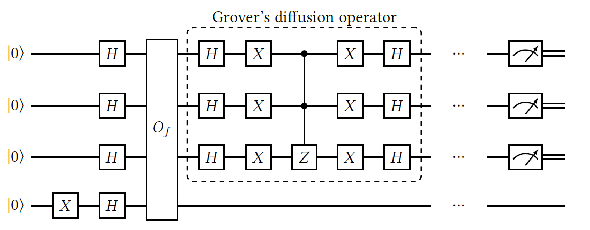
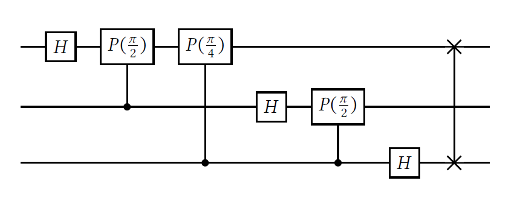

# GAS: Grover Adpative Search

Grover's algorithm is a quantum search algorithm used to find elements satisfying a specific condition. Given a collection indexed by $n$-bit strings and a Boolean function $f(x)$, the function returns 1 if the condition is satisfied and 0 otherwise. For example, with 8 elements, $f(x) = 1$ for $x = 010$ or $x = 100$, and $f(x) = 0$ otherwise.

We treat $f$ as a black box, meaning we can only call it with inputs and observe outputs, without knowing its inner workings. Since we lack information about which indices satisfy the condition, no position can be favored over another. In classical algorithms, searching among $N$ elements with one satisfying the condition requires about $N/2$ calls to $f$ on average, and up to $N-1$ in the worst case. 

Grover's algorithm, however, can locate the desired element with high probability using only about $\sqrt{N}$ calls. For instance, solving a problem with 1,000,000 elements requires just 1,000 calls instead of 500,000 in the classical case. To understand this, we need to explore **quantum oracles** and their applications.

---

## Takeaways
1.  Quantum orcale is a unitary and reversible quantum operator. See [Quantum oracles](../QOpt/GAS.md#quantum-oracles).
2.  Construction of a quantum orcale can be accomplished by using NOT gates and multi-CNOT gate. See [Quantum oracles](../QOpt/GAS.md#quantum-oracles).

---

## Quantum oracles

In the classical case, we have $n$ inputs and a single output. In the quantum world, this setup doesn't work because quantum operations must be **unitary** and therefore **reversible**. As a result, every quantum gate must have the same number of inputs and outputs!

The Quantum oracles, $O_{f}$, is an quantum gate (operation) of $f$ that take any input of $\lvert x\rangle \lvert y \rangle$, where $x$ is an $n$-bit string and $y$ is a single bit, and the output of the $O_{f}$ gate will be 

$$
O_{f} = \lvert x \rangle \lvert y \oplus f(x) \rangle
$$

where $\oplus$ denotes addition modulo 2. 

It might seem intuitive to think of the output as $\lvert x \rangle \lvert f(x) \rangle$. However, this could make the operation irreversible because different inputs $\lvert x \rangle$ that satisfy $f(x) = 1$ would produce the same output $\lvert x \rangle \lvert 1 \rangle$. Instead, we use a **reversible operation** $O_f$, which ensures reversibility by applying the transformation $\lvert x \rangle \lvert y \rangle \mapsto \lvert x \rangle \lvert y \oplus f(x) \rangle$. 

If $O_f$ is applied twice, the result is:

$$
\lvert x \rangle \lvert y \oplus f(x) \oplus f(x) \rangle = \lvert x \rangle \lvert y \rangle,
$$

since $f(x) \oplus f(x) = 0$ (modulo 2 addition). This ensures the operation remains reversible.

The operation $O_f$ is commonly referred to as a **quantum oracle** for $f$, as it allows us to evaluate $f(x)$ for any input $x$ without needing to understand its internal implementation.

For any Boolean function $f$, $O_f$ can always be constructed using only **NOT gates** and **multi-controlled NOT gates**. For instance, consider a Boolean function $f$ defined on 3-bit strings where $f(x) = 1$ only for $x = 101$ and $x = 011$. In this case, we can design a quantum circuit using multi-controlled NOT gates that target these specific inputs, flipping an ancillary qubit to encode $f(x)$. This circuit effectively implements the transformation $\lvert x \rangle \lvert y \rangle \mapsto \lvert x \rangle \lvert y \oplus f(x) \rangle$.

    
    

        Figure. Oracle for the Boolean function \(f\) that takes value 1 on 101 and 011, and value 0 on the rest of the 3-bit strings
    

In this example, we only used NOT gates before and after the multi-controlled gates to select those qubits that should be 0 in the input and to restore them to their original values.

!!! excercise
    Construct a circuit for $O_f$ where $f$ is a 4-bit Boolean function that takes value 1 on 0111, 1110, and 0101, and value 0 on any other input.

---

## Grover's circuits
Now, let's say that we want to apply Grover's algorithm to a Boolean function $f$ which receives binary strings of leangth $n$. Besides the quantum oracle $O_f$ we mentioned above, we still need two more elements to complete our circuit.

    
    

       Figure. Circuit for Grover’s algorithm in the case in which \(f\) receives strings of length 3 as input. The oracle \(O_f\) and Grover’s diffusion operator are repeated, in that order, a number of times before the final measurements
    

### **Phase kickback**:
    
The first block is composed of one-qubit gates that are applied to the initial state $\lvert0 \cdots 0\rangle \lvert 0 \rangle$, where the first integer is of length $n$ and the second one if of length 1. Thus the state before applying the oracle is 

$$
\begin{array}{lll}
H^{\otimes n+1} \lvert 0 \rangle ^{\otimes n}\lvert 1 \rangle 1 & = & \lvert + \rangle^{\otimes n} \lvert - \rangle \\
& = & \frac{1}{\sqrt{2^{n}}} \ ((\lvert 0 \rangle + \lvert 1 \rangle) \cdots (\lvert 0 \rangle + \lvert 1 \rangle)) \ \lvert + \rangle \\
& = & \frac{1}{\sqrt{2^{n}}}\sum_{x=0}^{2^{n}-1}\lvert x \rangle \lvert - \rangle
\end{array}
$$

because we apply the first $X$ gate to $\lvert 0 \rangle$ to obtain $\lvert 1 \rangle$.

The first register of this state is a **superposition** of all basis state $\lvert x \rangle$. This is exacatly what we will to evaluate $f$ "in superposition" with our application of the $O_{f}$ oracle.

To apply the quantum oracle, we have

$$
\begin{array}{lll}
O_f \bigg(\frac{1}{\sqrt{2^{n}}}\sum_{x=0}^{2^{n}-1}\lvert x \rangle \color{red}{\lvert - \rangle} \bigg) & = & O_f \bigg(\frac{1}{\sqrt{2^{n+\color{red}{1}}}}\sum_{x=0}^{2^{n}-1}\lvert x \rangle \color{red}{(\lvert 0 \rangle - \lvert 1 \rangle)}\bigg) \\ 
& = & O_f \frac{1}{\sqrt{2^{n+1}}}\sum_{x=0}^{2^{n}-1}\lvert x \rangle (\lvert 0 \rangle - \lvert 1 \rangle) \\
& = & \frac{1}{\sqrt{2^{n+1}}}\sum_{x=0}^{2^{n}-1}O_{f}\lvert x \rangle (\lvert 0 \rangle - \lvert 1 \rangle) \\
& = & \frac{1}{\sqrt{2^{n+1}}}\sum_{x=0}^{2^{n}-1}\lvert x \rangle (\lvert 0 \oplus f(x) \rangle - \lvert 1 \oplus f(x) \rangle) 
\end{array}
$$

Let's focus on $\lvert 0 \oplus f(x) \rangle - \lvert 1 \oplus f(x) \rangle$. We can interpret it as a XOR operator such that:

$$
\begin{array}{llll}
\lvert 0 \oplus f(x) \rangle - \lvert 1 \oplus f(x) \rangle & = & \lvert 0 \rangle - \lvert 1 \rangle, & \text{if} \ f(x) = 0 \\
\lvert 0 \oplus f(x) \rangle - \lvert 1 \oplus f(x) \rangle & = & -(\lvert 0 \rangle - \lvert 1 \rangle), & \text{if} \ f(x) = 1
\end{array}
$$

Thus, we can write it in a generalized form,

$$
\lvert 0 \oplus f(x) \rangle - \lvert 1 \oplus f(x) \rangle = (-1)^{f(x)}(\lvert 0 \rangle - \lvert 1 \rangle)
$$

As you may observe, there is information about the value $f(x)$ coded in the amplitude of the state now. Now let's put everything together!

$$
\begin{array}{lll}
O_f \bigg(\frac{1}{\sqrt{2^{n}}}\sum_{x=0}^{2^{n}-1}\lvert x \rangle \lvert - \rangle \bigg) & = & \frac{1}{\sqrt{2^{n+1}}}\sum_{x=0}^{2^{n}-1}\lvert x \rangle (-1)^{f(x)}(\lvert 0 \rangle - \lvert 1 \rangle) \\
    & = & \frac{1}{\sqrt{2^{n}}}\sum_{x=0}^{2^{n}-1}\lvert x \rangle (-1)^{f(x)}\color{red}{\frac{1}{\sqrt{2}}(\lvert 0 \rangle - \lvert 1 \rangle)} \\
    & = & \frac{1}{\sqrt{2^{n}}}\sum_{x=0}^{2^{n}-1}\lvert x \rangle \color{blue}{(-1)^{f(x)}}\color{red}{\lvert - \rangle}
\end{array}
$$

The application of $O_f$ introduces a **relative phase** ($\color{blue}{(-1)^{f(x)}}$) to some of the states $\lvert x \rangle$ in the superposition. This process is known as **phase kickback**, where the ancillary qubit in the $\lvert - \rangle$ state creates the phase, but it ends up influencing the entire quantum state. 

The phase associated with each basis state $\lvert x \rangle$ depends solely on $f(x)$: it is $1$ if $f(x) = 0$ and $-1$ if $f(x) = 1$. In this way, we say that the elements satisfying $f(x) = 1$ are **marked**. This phase shift doesn't change the probability of measuring any particular $\lvert x \rangle$ state (since probabilities depend on the magnitude, not the phase).

However, while this marks the desired elements, it doesn't directly help us find one of them. The probabilities of measuring each state remain unchanged before and after applying $O_f$. To identify the marked elements, we need a second step to amplify their probability, bringing them closer to detection.

### **Grover's diffusion operator**

The Grover diffusion operator is used to increase the probability of measuring the marked states by performing an operation called **inversion about the mean**. Here’s how it works:

1. The average amplitude $m$ of all the quantum states is calculated.
2. Each amplitude $a$ is then replaced with $2m - a$. 

This transformation reduces positive amplitudes slightly while increasing negative ones, a process also known as **amplitude amplification**. As a result, the amplitudes of the marked states (those we are interested in) become slightly larger.

However, a single application of this process is not enough to ensure a high probability of measuring a marked state. **To achieve this, the quantum oracle $O_f$ and the Grover diffusion operator are applied repeatedly.** This iterative process amplifies the amplitudes of the marked states with each step, until their probability of being measured is high (close to 1). At that point, a measurement can be performed to successfully identify one of the marked states.

!!! Question
    You may ask, so how many times should we apply $O_{f}$ with Grover's diffusiont operator?

---

## Probability of finding a marked element
There's one very important obervation about the $O_{f}$ and the Grover's diffusion is that the combination of these two acts just like a **rotation in a two-dimensional space**. Let’s assume we have $n$-bit strings and only one marked element, $x_1$. It can be shown that after $m$ iterations of applying $O_f$ and the Grover diffusion operator, the quantum state becomes:

$$
\cos(2m+1)\theta \lvert x_{0} \rangle + \sin(2m+1)\theta \lvert x_{1} \rangle,
$$

where 

$$
\lvert x_{0} \rangle = \sum_{x \in \{ 0, 1 \}^{n}, \ x \neq x_{1}}\sqrt{\frac{1}{2^{n}-1}}\lvert x \rangle
$$

is the superposition of all unmarked states and $\theta \in (0, \pi/2)$ is such that 

$$
\begin{array}{ll}
\cos \theta =  \sqrt{\frac{2^{n}-1}{2^{n}}}, & \sin \theta = \sqrt{\frac{1}{2^{n}}}.
\end{array}
$$

Notice that $\lvert x_{0} \rangle$ is just the **uniform superposition** of the state $\lvert x \rangle$ such that $f(x) = 0$. Therefore, as you know, we want to obtain the state where $\sin (2m +1) \theta$ is close to 1. That is,

$$
(2m + 1) \theta \approx \frac{\pi}{2}
$$

Solving for $m$

$$
m \approx \frac{\pi}{4\theta} - \frac{1}{2}.
$$

More, by plugging in $\sin \theta = \sqrt{1/2^{n}}$ and we asigning a big enough of $n$, we then have 

$$
\theta \approx \sqrt{\frac{1}{2^{n}}}
$$

After plugging it into $m$, 

$$
m = \frac{\pi}{4}\sqrt{2^{n}}.
$$

that is, **the biggest integer that is less than or equal to $(\pi/4)\sqrt{2^{n}}$**

In this scenario, there are $2^n$ elements, but only one satisfies the condition we are searching for. A classical algorithm would require about $2^n / 2$ calls to $f$, on average, to find the solution. In contrast, Grover's algorithm significantly reduces this to approximately $\sqrt{2^n}$ calls.

However, there's an important distinction: while classical algorithms steadily increase the probability of finding the solution as $f$ is used more, Grover's algorithm requires careful selection of the number of iterations $m$. If $m$ is not chosen wisely, the algorithm can overshoot and reduce the probability of finding the solution. 

The probability of measuring the correct result $x_1$ is given by $(\sin((2m+1)\theta))^2$, a periodic function. After reaching values close to 1, the probability decreases back to 0, meaning the success rate oscillates.

If there are $k$ marked elements instead of just one, the same reasoning applies. A good choice for $m$ in this case is:

$$
m = \frac{\pi}{4} \sqrt{\frac{2^n}{k}},
$$

where $k$ is small compared to $2^n$. This ensures the probability of measuring one of the marked elements is maximized.

Let's see the following example:

    
    

        Figure: Probability of finding one marked element among 16 when using Grover’s algorithm with a number of iterations that varies from 0 to 20
    

In this example, we consider the case where $n = 4$ and analyze how the probability of finding exactly one marked element varies with the number of Grover iterations $m$, ranging from 0 to 20. 

In this scenario, $\lfloor (\pi/4) \sqrt{2^n} \rfloor$ is 3. As shown, the success probability when $m = 3$ is close to 1. However, with $m = 5$, the probability drops significantly, and by $m = 6$, it is nearly 0.

---

## Finding Minima with Grover's Algorithm

Finding a minimum involves identifying a value that satisfies a specific property. Suppose we want to find the minimum of a function $g$ defined over binary strings of length $n$. Here’s how we can use Grover's algorithm for this task:

1. **Initialization**: Select an initial binary string $x_0$ at random and compute $g(x_0)$.

2. **Oracle Setup**: Construct an oracle that, on input $x$, returns 1 if $g(x) < g(x_0)$ and 0 otherwise.

3. **Grover's Search**: Apply Grover's algorithm using the constructed oracle to search for an $x_1$ such that $g(x_1) < g(x_0)$.

4. **Update**: 
    - If $g(x_1) < g(x_0)$, replace $x_0$ with $x_1$ and update the oracle to check the condition $g(x) < g(x_1)$.
    - If $g(x_1) \geq g(x_0)$, keep $x_0$ as it is and continue.

5. **Iteration**: Repeat this process multiple times, progressively narrowing down the search, until the minimum value is found.

---

## Quantum oracles for combinatorial optimization

To further explore the Dürr-Høyer algorithm and its application in finding minima, the next step involves constructing a **quantum oracle** capable of comparing two inputs $x$ and $y$ to determine whether $g(x) < g(y)$. This oracle serves as a fundamental component for implementing the algorithm to identify the minimum of a given function $g$.

We will initiate this investigation by addressing specific cases, namely **QUBO** (Quadratic Unconstrained Binary Optimization) and **HOBO** (Higher-order Binary Optimization), where the coefficients of the polynomials are integer-valued. Building on this foundation, we will extend the discussion to more general cases, accommodating scenarios where the coefficients are real numbers.

Before advancing to these topics, it is imperative to examine one of the most critical subroutines in quantum computing: the **quantum Fourier transform (QFT)**. A thorough understanding of the QFT is essential for constructing and leveraging the quantum oracle effectively. Let us begin by exploring this fundamental tool.

---

## The quantum Fourier transform
The **quantum Fourier transform (QFT)** is a fundamental and highly versatile tool in quantum computing. It plays a critical role in various quantum algorithms, such as Shor's algorithm for integer factorization and the HHL algorithm for solving linear systems of equations.

In our context, the QFT will be utilized to facilitate the arithmetic operations required to compute the values of polynomial functions in **QUBO** (Quadratic Unconstrained Binary Optimization) and **HOBO** (Higher-order Binary Optimization) problems.

The QFT on $m$-qubits is defined as a unitary transformation that maps the computational basis state $\lvert j \rangle$ to:

$$
\frac{1}{\sqrt{2^m}} \sum_{k=0}^{2^m-1} e^{\frac{2\pi i j k}{2^m}} \lvert k \rangle,
$$

where $i$ represents the imaginary unit. This transformation uses the principles of quantum superposition and interference, making it a powerful component for efficiently implementing arithmetic and optimization processes in quantum algorithms.

The QFT can be implemented with a number of one- and two- qubit gates that is quadratic in $m$.

For instance, the circuit for the QFT on three qubits is shown below. As you can see, the rightmost gate, which acts on the top and bottom qibits, is the **SWAP gate**. Moreover, this QFT circuit uses the **phase gate**, denote by $P(\theta)$. This is a parameterized gate that depends on an angle $\theta$ and whose coordinate matrix is 

$$
\begin{pmatrix}
1 & 0\\
0 & e^{i\theta}
\end{pmatrix}
$$

    
    

        Figure: A circuit example for the quantum Fourier transform on 3 qubits.
    

!!! note 
    The phase gate is closely related to the $R_Z$ gate introduced earlier. Specifically, when applied to a single qubit, the phase gate $P(\theta)$ is equivalent to $R_Z(\theta)$, differing only by an insignificant global phase. However, in the context of the QFT circuit, a **controlled version** of the phase gate is used. In this case, the global phase becomes a **relative phase**, which is highly significant and cannot be ignored.

The QFT acts by introducing phases of the form $e^{2\pi ijk/2^{m}}$ when it is applied on basis state $\lvert j \rangle$ and we are insterested in recovering the values $j$ from those phases. Therefore, as you can imagine, we need to perform the **inverse quantum Fourier transform** ($\text{QFT}^\dagger$) 

$$
\frac{1}{\sqrt{2^{m}}}\sum_{k=0}^{2^{m}-1} e^{\frac{2\pi ijk}{2^m}}\lvert k \rangle
$$

to tha basis state $\lvert j \rangle$.

The circuit for the inverse QFT can be obtained from that of the QFT by reading the circuit backwards and using the inverse of each gate we find. 

1. The inverse of $P(\theta)$ is $P(-\theta)$
2. The inverse of H and SWAP are its own.

    
    

        Figure. Circuit for the inverse quantum Fourier transform on 3 qubits.
    

When designing a quantum oracle to minimize a function $g$, our goal will be to perform the computation in such a way that the $g(x)$ values appear as exponents in the amplitudes of our states so that we can later recover them by means of the inverse QFT.

### Takeaways
1.  Steps for Using QFT in QUBO/HOBO Optimization:
    The **calculation** between the QFT and the inverse QFT typically involves manipulating the **phases** encoded by the QFT to perform operations like comparisons, arithmetic, or optimizations. Here's the breakdown:

    -   **Basis $\lvert j \rangle$ to $\lvert k \rangle$ via QFT**:
        -   QFT maps $\lvert j \rangle$ to a superposition of $\lvert k \rangle$ states with phases $e^{2\pi i jk / 2^m}$.
        -   The phases encode the computational input $j$.

    -   **Calculation (Phase Manipulation)**:
        -   Perform operations on the encoded phases to solve the problem:
            -   **Arithmetic**: For QUBO/HOBO, encode polynomial $g(x)$ values into the phases $e^{i g(x)}$.
            -   **Comparison**: Use controlled operations to compare values (e.g., $g(x) < g(y)$).
            -   **Optimization**: Apply Grover's algorithm or similar methods to amplify desirable states (e.g., states with lower $g(x)$).

    -   **Inverse QFT (Recover Results)**:
        -   After the calculation, the inverse QFT decodes the manipulated phases back into the original basis $\lvert j \rangle$, revealing the result of the computation.

2. Advangates:
    -   **Efficient Encoding and Representation**: QFT maps polynomial function values into quantum phases, enabling compact and efficient representation of large and complex optimization problems.

    -   **Parallelism via Superposition**: Allows simultaneous evaluation of $g(x)$ for multiple inputs, drastically reducing computation time compared to classical methods.

    -   **Facilitates Grover’s Algorithm**: Seamlessly integrates with Grover’s search to amplify the probability of finding optimal solutions, leveraging quantum speedup for minimization tasks.

    -   **Precision for Complex Problems**: Ensures high accuracy in encoding and manipulating polynomial coefficients, critical for handling intricate interactions in HOBO and QUBO.

    -   **Scalability**: Efficient gate usage ($O(m^2)$) makes QFT scalable to larger problem sizes, making it practical for real-world applications.           

---

## Encoding and adding integer numbers

When working with integer numbers, the **two's complement** representation is the most convenient method. Using $m$-bit strings, this representation encodes numbers in the range $-2^{m-1}$ to $2^{m-1} - 1$. 

-   **Positive numbers** are represented as standard binary numbers.
-   **Negative numbers** $x$ are represented as $2^m - |x|$. For example, with $m = 4$:
    -   $3$ is represented as $0011$,
    -   $-5$ is represented as $1011$ (since $2^4 - 5 = 11$, and the binary representation of $11$ is $1011$).

This system ensures that positive numbers always start with $0$, and negative numbers start with $1$.

Two's complement simplifies addition involving both positive and negative numbers by allowing standard binary addition, followed by discarding the final carry-out. Examples:

1.  Adding $0011$ ($3$) and $1101$ ($-5$):
   
    $$
    0011 + 1101 = 11110 \quad \text{(5 bits, discard the carry-out to get $1110$)}.
    $$

    Result: $1110$, which is $-2$ in two's complement.

2.  Adding $0110$ ($6$) and $1100$ ($-4$):
   
    $$
    0110 + 1100 = 10010 \quad \text{(5 bits, retain the lower 4 bits: $0010$)}.
    $$

    Result: $0010$, which is $2$.

!!! exercise 
    Using two’s complement with 5 qubits, represent 10 and −7 and perform their addition.
??? Answer
    1.  First we write $10$: $01010$ and $-7$: $11001$ ($2^5 - 7 = 25$).
    2.  then we perform the addition $01010 + 11001 = 100011 \quad \text{(6 bits)}$.
    3. Then we keep the lower 5 bits: $00011$. The final result is $00011$ = $3$.

When computing $g(x)$ with an oracle, we are intersted in obtaining the state

$$
\frac{1}{\sqrt{2^{m}}} \sum_{k=0}^{2^{m}-1} e^{\frac{2\pi i g(x) k}{2^{m}}} \vert k \rangle,
$$

so that we can apply the [**inverse QFT**](../QOpt/GAS.md#the-quantum-fourier-transform) to get $\lvert g(x) \rangle$. Notice that $g(x)$ is always a sum of products of integer values. 

The **phase encoding of $j$** represents the transformation of a state into a quantum superposition with specific phase factors.

$$
\frac{1}{\sqrt{2^{m}}}\sum_{k=0}^{2^{m}-1} e^{\frac{2 \pi i j k}{2^{m}}} \lvert k \rangle
$$

Let's start with phase encoding of $\color\red{0}$. To achieve this, we just apply the Hadamard gate to each and every qubit that we are using to represent the integer values. In this way, we will obtain the state

$$
\frac{1}{\sqrt{2^{m}}}\sum_{k=0}^{2^{m}-1}\lvert k \rangle = \frac{1}{\sqrt{2^{m}}}\sum_{k=0}^{2^{m}-1} e^{\frac{2 \pi i \color\red{0} k}{2^{m}}} \lvert k \rangle
$$

which is the phase encoding of $\color\red{0}$.

Suppose that we have a state that phase-encodes $j$ and we want to add $l$ to it. We first assume that $l$ is non-negative and deal with negative numbers later. To add $l$ in phase encoding, we just need to apply the gates shown below

    
    

        Figure. Circuit for adding \(l\) to a state in phase encoding when we have \(m\) qubits.
    

When we apply those gates to a basis state $k$, we obtain $e^{\frac{2 \pi i l k}{2^{m}}} \lvert k \rangle$. Thus, by linearity, when we apply the circuit to the phase encoding of $j$, we get

$$
\frac{1}{\sqrt{2^{m}}}\sum_{k=0}^{2^{m}-1} e^{\frac{2 \pi i j k}{2^{m}}}e^{\frac{2 \pi i l k}{2^{m}}} \lvert k \rangle = \frac{1}{\sqrt{2^{m}}}\sum_{k=0}^{2^{m}-1} e^{\frac{2 \pi i (j+l) k}{2^{m}}} \lvert k \rangle
$$

which is the phase encoding of $j+l$. 

For negative numbers, we can still apply figure above without additional adjustment. The key observation is that, for any integer $0\leq h \leq m-1$, it holds that 

$$
e^{\frac{\pi i(2^{m}+l)}{2^h}} = e^{\frac{\pi il}{2^h}}e^{\frac{\pi i2^{m}}{2^h}} = e^{\frac{\pi il}{2^h}}e^{\pi i 2^{m-h}} = e^{\frac{\pi il}{2^h}}
$$

since $m-h > 0$, making $2^{m-h}$ even and implying $e^{\pi i 2^{m-h}} = 1$. This means that if we plug in $l$ or $2^{m}+l$ in the gates of [figure](../images_QOpt/phase_encoding_adding_l.png) above, we obtain exactly the same circuit. Thus, we can work with the two's complement representation of $l$.

    
    

        Figure presents a circuit that prepares the phase representation of 0, adds 3 to it and then subtracts 5. Of course, we can simplified the circuit such as \(P(-5\frac{\pi}{2})P(3\frac{\pi}{2}) = P(\pi)\) and \(P(3\pi) = P(\pi)\). Since the phase \(\phi\) is a modulo \(2\pi\) quantity becasue \(e^{i(\pi +2\pi)}\). That is, adding \(2\pi\) to the phase does not change the effect of the gate.
    

$$
3 \pi \ \text{mod} \ 2\pi = \pi.
$$

---

## Computing the whole polynomial

Here is an example of a quantum circuit that computes the polynomial $3x_0x_1 - 2x_1x_2 + 1$:

1.  **First Column**: The first column of gates prepares the **phase encoding of 0**, creating a uniform superposition state as the initial step.
2.  **Second Column**: The next set of gates adds the constant term $+1$ to the phase encoding.
3.  **Third Column**: This column adds $+3$, but only if $x_0 = x_1 = 1$. To achieve this, all gates in this column are **controlled by the qubits $\lvert x_0 \rangle$ and $\lvert x_1 \rangle$**. The operation ensures that the term $3x_0x_1$ contributes only when $x_0$ and $x_1$ are both 1.
4.  **Fourth Column**: The final column subtracts $2$, but only when $x_1 = x_2 = 1$. This is implemented using controlled gates activated by $\lvert x_1 \rangle$ and $\lvert x_2 \rangle$.

    
    

        Figure. Circuit for computing \(3x_{0}x_{1} - 2x_{1}x_{2} + 1\) in phase encoding. 
    

!!! Note

    Controlled gates execute their quantum operation (e.g., adding or subtracting a phase) only when the control qubits are in a specific state, typically $\lvert 1 \rangle$. For example:

    -   $3x_0x_1$ contributes only when $x_0 = x_1 = 1$, as enforced by the controlled gates.
    -   $-2x_1x_2$ contributes only when $x_1 = x_2 = 1$.

    These conditions ensure that each term in the polynomial is included in the computation only when logically valid. Controlled gates enforce these conditions, activating their operations only when the control qubits satisfy the required state.

From the [figure](../images_QOpt/circuit_computing_example_in_pahse_encoding.png), we have adopted the usual convention of setting all the one-qubit gates that are controlled by the same qubits in a single column. This technique is also called as a **single multi-qubit gate**. Also, you may notice that these gates are multi-controlled, but you can always decompose them into a combination of one and two-qubit gates with Toffoli gates.

There are two methods that we can use to deal with the real numbers in phase encoding.

1. **Approximation Using Fractions:**
    -   Represent real coefficients as fractions (e.g., $0.25 = 25/100$, $-1.17 = -117/100$).
    -   Multiply the polynomial by the denominator ($100$) to convert coefficients to integers while preserving structure.
    -   Example: $0.25x_0 - 1.17x_1 \to 25x_0 - 117x_1$.

2. **Direct Encoding:**
    -   Encode real coefficients directly by creating a **superposition of approximations** with the largest amplitude for the best approximation.
    -   Example: Coefficient $0.73$ encoded as a superposition of $0.7, 0.73, 0.75$.

## Constructing the oracle

This diagram represents an **oracle** to determine whether $g(x) < g(y)$, utilizing quantum operations. Here’s a breakdown of its components and functionality:

    
    

        Figure of a oracle to determine \(g(x) < g(y)\).
    

If $g(x) < g(y)$, then $g(x) - g(y) < 0$, and the most significant bit (MSB) of $g(x) - g(y)$ will be $1$. Using a CNOT gate, we set the bottom qubit ($z$) to $\lvert 1 \rangle$ if $g(x) < g(y)$ and $\lvert 0 \rangle$ otherwise.

However, after obtaining $z$, we must reset the $m$ auxiliary qubits to $\lvert 0 \rangle$ for correct subsequent operations, such as Grover's algorithm, and to disentangle them from the circuit. If left entangled, these qubits could disrupt the computation.

This reset process is called **uncomputation**. It involves reversing the operations used to compute $g(x) - g(y)$. By applying the inverse QFT, the subtraction is undone, and the qubits return to their initial phase encoding of $0$. Applying Hadamard gates then ensures the auxiliary qubits are reset to $\lvert 0 \rangle$, preserving the circuit's integrity for further computations.

### How to Read the Circuit
1.  **Input Qubits**:
    -    $\lvert x \rangle$ and $\lvert y \rangle$: Represent binary strings for $x$ and $y$.
    -    $\lvert 0^m \rangle$: Auxiliary qubits initialized to $\lvert 0 \rangle$.
    -    $\lvert 0 \rangle$: A single qubit to store the result ($z$).

2.  **Steps**:

    -    **Hadamard Gates**: Prepare the auxiliary qubits in a superposition.
    -    **Compute $g(x) - g(y)$**: Apply arithmetic gates to encode $g(x) - g(y)$ in the auxiliary qubits.
    -    **Apply Inverse QFT ($\text{QFT}^\dagger$)**: Decode the phase encoding into a computational basis state for comparison.
    -    **CNOT Gate**: Compare $g(x) - g(y)$. If $g(x) < g(y)$, the MSB is $1$, flipping the $\lvert z \rangle$ qubit.
    -    **Uncompute**:
        -   Apply the QFT and reverse $g(x) - g(y)$ (now $g(y) - g(x)$).
        -   Reset auxiliary qubits to $\lvert 0 \rangle$ using Hadamard gates.

### Why Inverse QFT Comes First
The **Inverse QFT** ($\text{QFT}^\dagger$) is applied after computing $g(x) - g(y)$ because it converts the phase-encoded result into a basis state, allowing the MSB to be read and compared using the CNOT gate. Without the inverse QFT, the phase-encoded information could not be directly accessed or interpreted.

More, we can also create oracles to check whether polynomial constraints are met or not, like $3x_{0} - 2x_{0}x_{1} < 3$. This allows constraints to be incorporated into the optimization process without transforming the problem entirely into a QUBO form. This approach can sometimes be more convenient than using penalty terms for constraints.

---

## Using GAS with Qiskit
Please see [GAS Qiskit Molecule](../jupyter_QOpt/GAS_Qiskit_molecule.ipynb)