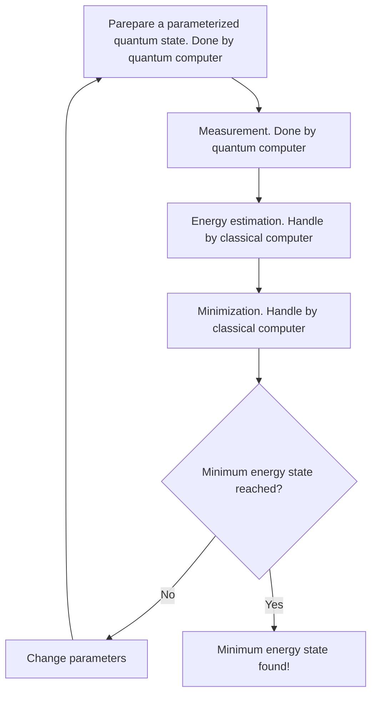

# Variational Quantum Eigensolver (VQE)
The **Variational Quantum Eigensolver (VQE)** is a hybrid quantum-classical algorithm for solving optimization problems and finding ground-state energies in quantum systems, with applications in chemistry and physics. 

VQE uses a parameterized quantum circuit to prepare states and a classical optimizer to minimize the expectation value of a Hamiltonian, iteratively refining the solution. It generalizes the Quantum Approximate Optimization Algorithm (QAOA), with QAOA being a specific instance of the VQE framework, making VQE a versatile tool for quantum computations.

---

## Hamiltonians, observables, and their expectation values 
### Hamiltonians 

From QUBO (Quadratic Unconstrained Binary Optimization), we know that we start with a cost function $f$ that maps binary strings of length $n$ to real numbers, aiming to find the binary string $x$ that minimizes $f(x)$. To approach this problem quantum mechanically, we define a Hamiltonian $H_f$ such that:

$$
\langle x | H_f | x \rangle = f(x)
$$

for every binary string $x$ of length $n$. Solving the optimization problem then translates to finding the ground state of $H_f$—a quantum state $\lvert \psi \rangle$ that minimizes the expectation value $\langle \psi | H_f | \psi \rangle$.

Additionally, $H_f$ satisfies a key property: for every computational basis state $\lvert x \rangle$, the Hamiltonian acts as:

$$
H_f \lvert x \rangle = f(x) \lvert x \rangle.
$$

This implies that $\lvert x \rangle$ are **eigenstates** of $H_f$, with **eigenvalues** corresponding to the cost function $f(x)$ because:

1.  We use Hamiltonians that are sums of tensor products of $Z$ matrices themselves.
2.  The sum of diagonal matrices are still diagonal
3.  Since these Hamiltonians are diagaonial, the computational basis states are their eignevalues.

This property enables a direct connection between the classical optimization problem and the quantum framework.

From the linear algebra, if we have a state $\lvert \psi \rangle$, we can always write it as a linear combination of the computational basis states such that 

$$
\lvert \psi \rangle = \sum_{x} a_{x} \lvert x \rangle
$$

where the sum is over all the computational basis states $\lvert x \rangle$ and $a_{x} = \langle x | \psi \rangle$, since 

$$
\langle x | \psi \rangle = \langle \sum_{y} a_{y} \lvert y \rangle = \sum_{y} a_{y} \langle y | \psi \rangle = \sum_{y} a_{y} \langle x | y \rangle = a_{x}.
$$

$\sum_{y} a_{y} \langle x | y \rangle = a_{x}$ is because the fact that $\langle x | y \rangle = 1$  if $x = y$ and 0 otherwise. (The computational basis is an [orthonormal basis](/docs/Math_Fundamentals/matrices.md#orthonormal-basis)).

Thus, the expectation value of $H_{f}$ in the state $\lvert \psi \rangle$ can be computed as 

$$
\begin{array}{lll}
\langle x | H_{f} | x \rangle & = & \sum_{y} a^{*}_{y} \langle y | H_{f} \sum_{x} a_{x} | x \rangle\\
 & = & \sum_{x,y} a^{*}_{y} a_{x} \langle y | H_{f} | x \rangle\\
 & = & \sum_{x,y} a^{*}_{y} a_{x} f(x) \langle y | x \rangle \\
 & = & \sum_{x} a_{x}^{*} a_{x} f(x) = \sum_{x} |a_x|^{2} f(x).
\end{array}
$$

**We also know that $|a_x|^{2} = |\langle x | \psi \rangle|^{2}$ is the probability of obtaining $|x\rangle$ when measuring $\lvert \psi \rangle$ in the computational basis**. That is, The expectation value matches the statistical expected value of the measurement.

### Observables in Quantum Mechanics
In quantum mechanics, any measurable physical quantity, known as an observable, is represented by a **Hermitian operator**. A Hermitian operator $A$ satisfies the property $A^\dagger = A$, where $A^\dagger$ is its conjugate transpose.

A key property of Hermitian operators is that they always have an **orthonormal basis of eigenvectors with real eigenvalues**. This means there exist real numbers $\lambda_j$ ($j = 1, \cdots, l$) and corresponding states $\lvert \lambda_j^k \rangle$ ($j = 1, \cdots, l$ and $k = 1, \cdots, r_j$), such that the eigenstates $\{\lvert \lambda_j^k \rangle \}_{j,k}$ form an orthonormal basis and satisfy the eigenvalue equation:

$$
A \lvert \lambda_j^k \rangle = \lambda_j \lvert \lambda_j^k \rangle,
$$

for each $j = 1, \cdots, l$ and $k = 1, \cdots, r_j$.

Here: 

1.  **Degeneracy of Eigenvalues**: Multiple eigenvectors $\lvert \lambda_j^k \rangle$ can correspond to the same eigenvalue $\lambda_j$. The number of such eigenvectors is denoted by $r_j$, representing the degeneracy of $\lambda_j$.
    - If all eigenvalues are distinct, $r_j = 1$ for all $j$, and the $k$-index can be dropped. $k$ as $k$-th eignestate.

2.  **Measurement Outcomes**: 
    - Any Hermitian operator $A$, representing an observable, has eigenvalues $\lambda_j$, which correspond to the possible outcomes of a measurement.
    - For a quantum state $\lvert \psi \rangle$, the probability of measuring a specific eigenvalue $\lambda_j$ is given by:

$$
P(\lambda_j) = \sum_k \big|\langle \lambda_j^k \lvert \psi \rangle\big|^2.
$$

This ensures that any physical observable can be represented by a Hermitian operator, and the eigenvalue equation governs both the measurement outcomes and their probabilities.

!!! note
    Remember, in quantum mehcanics, if the measurement returns the result associated to an eigenvalue $\lambda_{j}$, the state of the system will then become the normalized projection of $|\psi \rangle$ onto the space of eigenvectors with eigenvalue $\lambda_{j}$.

That is, if we measure a state in a superposition such as 

$$
\sum_{j,k} a_{j}^{k} \lvert \lambda_{j}^{k} \rangle
$$

and we obtain $\lambda_{j}$ as the result, then the new state will be

$$
\frac{\sum_{j,k} a_{j}^{k} \lvert \lambda_{j}^{k} \rangle}{\sqrt{\sum_{j,k} |a_{j}^{k}|^{2}}}.
$$

This is the **collapse** of the original state! For instance, whenever we measure in the computational basis, we are indeed measuring some physical observable, and this physical observable can be represented by a Hermitian operator.

The coordinated matrix of this measurement operator with respect to the computational basis could be the diagonal matrix 

$$
\begin{pmatrix}
0 & & & \\
& 1 & & \\
& & \ddots & \\
& & & 2^n - 1
\end{pmatrix}
$$

when we measure a single qubit in the computational basis, the coordinate matrix with respect to the computational basis of the associated hermitian operator could be either of

$$
\begin{array}{cc}
    N = 
    \begin{pmatrix}
    0 & 0 \\
    0 & 1
    \end{pmatrix}
    ,&
    Z = 
    \begin{pmatrix}
    1 & 0 \\
    0 & -1
    \end{pmatrix}
    .
\end{array}
$$

Both of these operators represent the same observable: they only differ in the eigenvalues that they associate to the distinct possible outcomes. 

1. N operator: eigenvalues 0 and 1 to the qubit's value being 0 and 1 respectively.
2. Z operator: eigenvalues 1 and -1 to these outcomes.

#### Key takeaways

1.  An observable is the mathematical representation of a physical property of a quantum system represented by a **Hermitian operator**.
    -   An observable corresponds to a physical property that can be measured, such as energy or position.
    -   In the quantum framework, an observable is represented by a Hermitian operator $A$. For example, the energy of a system is associated with the Hamiltonian H, which is a Hermitian operator.
    -   When you measure an observable, the possible outcomes correspond to the eigenvalues of the operator.
    -   An observable is not the action of measuring—it’s the property being measured. The action of measurement is distinct and involves interacting with the system.

2. {==Measurements in quantum mechanics are represented by Hermitian operators, which we refer to as observable.==} One possible operator corresponding to measuring a qubit in the computational basis can be the Pauli Z matrix.

---

### Expectation values 
Let's see what **expectation value** is and how it can be computed. First, we know that the probability of measuring a specific eigenvalue $\lambda_j$ is given by

$$
P(\lambda_j) = \sum_k \big|\langle \lambda_j^k \lvert \psi \rangle\big|^2.
$$

The expectation value of any observable under a state $\lvert \psi \rangle$ can be defined as 

$$
\langle A \rangle_{\psi} = \sum_{j,k} |\langle \lambda_{j}^{k}|\psi \rangle|^{2} \lambda_{j}, 
$$

which is a natural definition that agrees with the statistical expected value of the results obtained when we measure $\lvert \psi \rangle$ according to $A$. Therefore, we can further simplify it as follows:

$$
\begin{array}{lllll}
\langle A \rangle_{\psi} & = & \sum_{j,k}|\langle \lambda_{j}^{k} | \psi \rangle |^{2} \lambda_{j} & = & \sum_{j,k} \langle \psi | \lambda_ {j}^{k} \rangle \langle \lambda_ {j}^{k} | \psi \rangle \lambda_{j}\\
 & = & \sum_{j,k} \langle \lambda_ {j}^{k} | \psi  \rangle \langle \psi | \lambda_ {j}^{k} \rangle \lambda_{j} & = &\sum_{j,k} \langle \lambda_ {j}^{k} | \psi \rangle \langle \psi | A | \lambda_ {j}^{k} \rangle\\
 & = & \langle \psi | A \sum_{j,k} \rangle \lambda_{j}^{k} | \psi \rangle | \lambda_{j}^{k} \rangle & = & \langle \psi | A | \psi \rangle
\end{array}
$$

Let's look into these steps by steps! Let's start with the first row.

1.  For the first term

    $$
    \langle A \rangle_{\psi} = \sum_{j,k} \left| \langle \lambda_{j}^{k} | \psi \rangle \right|^2 \lambda_{j}.
    $$

    -   $\langle \lambda_{j}^{k} | \psi \rangle$: Projection (Inner product!) of the state $|\psi\rangle$ onto the eigenstate $|\lambda_{j}^{k}\rangle$.
    -   $\sum \left| \langle \lambda_{j}^{k} | \psi \rangle \right|^2$: Probability of obtaining the eigenvalue $\lambda_{j}$ upon measurement.
    -   $\lambda_{j}$: Measurable value (eigenvalue) associated with the eigenstate.

    This form means the expectation value as a sum over the probabilities of each measurement outcome multiplied by the corresponding eigenvalue $\lambda_{j}$.

2.  The second term

    $$
    \langle A \rangle_{\psi} = \sum_{j,k} \langle \psi | \lambda_{j}^{k} \rangle \langle \lambda_{j}^{k} | \psi \rangle \lambda_{}.
    $$

    -   The probabilities are expressed in terms of the inner products $\langle \psi | \lambda_{j}^{k} \rangle$ and $\langle \lambda_{j}^{k} | \psi \rangle$, showing explicitly how the state $|\psi\rangle$ interacts with the eigenbasis $|\lambda_{j}^{k}\rangle$.

    -   The eigenstates $|\lambda_{j}^{k}\rangle$ form an [orthonormal basis](/docs/Math_Fundamentals/matrices.md#orthonormal-basis), so the squared magnitude $\left| \langle \lambda_{j}^{k} | \psi \rangle \right|^2$ is equivalent to the product $\langle \psi | \lambda_{j}^{k} \rangle \langle \lambda_{j}^{k} | \psi \rangle$.

The equation shows how the expectation value of a Hermitian operator (observable) is calculated by summing over all possible eigenvalues $\lambda_{j}$, weighted by the probability of measuring $\lambda_{j}$ when the system is in state $|\psi\rangle$. The expectation value $\langle A \rangle_{\psi}$ is the weighted average of the possible outcomes $\lambda_{j}$, with the probabilities $\left| \langle \lambda_{j}^{k} | \psi \rangle \right|^2$ serving as weights.

3.  Then, the next equations show how the **expectation value** of a Hermitian operator $A$ in a quantum state $|\psi\rangle$ is derived, step by step. Let’s break it down:

-   First Step:

    $$
    \sum_{j,k} \langle \psi | \lambda_j^k \rangle \langle \lambda_j^k | \psi \rangle \lambda_j
    = \sum_{j,k} \langle \lambda_j^k | \psi \rangle \langle \psi | \lambda_j^k \rangle \lambda_j
    $$
    
    -   This step shows that the ordering of inner products doesn't matter **due to the properties of complex conjugatio**n.

-   Second Step:

    $$
    \sum_{j,k} \langle \lambda_j^k | \psi \rangle \langle \psi | A | \lambda_j^k \rangle
    = \langle \psi | A \sum_{j,k} | \lambda_j^k \rangle \langle \lambda_j^k | \psi \rangle
    $$

    -   Here, $\lambda_j | \lambda_j^k \rangle = A | \lambda_j^k \rangle$, because $| \lambda_j^k \rangle$ is an eigenstate of $A$ with eigenvalue $\lambda_j$.
    -   The summation $\sum_{j,k} | \lambda_j^k \rangle \langle \lambda_j^k |$ represents the **resolution of identity ($I$)**, which means that any state can be expressed in this eigenbasis.

-   Final Step:

    $$
    \langle \psi | A | \psi \rangle
    $$

    -   This simplifies the expectation value entirely into the form $\langle \psi | A | \psi \rangle$, which is the standard expression for the expectation value of a Hermitian operator $A$ in the state $|\psi\rangle$.

-   Physical Interpretation:

    -   The derivation connects the abstract summation over eigenvalues and eigenstates to the compact, widely-used notation $\langle \psi | A | \psi \rangle$.
    -   The expectation value $\langle \psi | A | \psi \rangle$ represents the average value of many measurements of the observable $A$ when the system is in state $|\psi\rangle$.

Notice that we have used the fact that $A|\lambda_{j}^{k}\rangle = \lambda_{j}|\lambda_{j}^{k} \rangle$ and that $|\psi \rangle = \sum_{j,k} | \lambda_{j}^{k} | \psi \rangle | \lambda_{j}^{k} \rangle$.

!!! Note 
    The expectation value of any Hermitian operator (observable) $A$ is given by
    
    $$
    \langle A \rangle_{\psi} = \sum_{j,k}|\langle \lambda_{j}^{k} | \psi \rangle |^{2} \lambda_{j} = \langle \psi | A | \psi \rangle.
    $$

The **variational principle** states that the smallest expectation value of an observable $A$ is always achieved at an eigenvector of $A$. Suppose $\lambda_0$ is the smallest eigenvalue of $A$. For any quantum state $\lvert \psi \rangle$, the expectation value of $A$ is given by:

$$
\langle A \rangle_\psi = \sum_{j,k} \big| \langle \lambda_j^k \lvert \psi \rangle \big|^2 \lambda_j.
$$

Since $\lambda_0$ is the minimal eigenvalue, it follows that:

$$
\langle A \rangle_\psi \geq \sum_{j,k} \big| \langle \lambda_j^k \lvert \psi \rangle \big|^2 \lambda_0 = \lambda_0,
$$

where the last equality arises because the probabilities of all possible outcomes add up to 1, i.e., $\sum_{j,k} \big| \langle \lambda_j^k \lvert \psi \rangle \big|^2 = 1$.

Now, consider an eigenvector $\lvert \lambda_0^k \rangle$ associated with $\lambda_0$. The expectation value of $A$ for this eigenvector is:

$$
\langle \lambda_0^k \lvert A \lvert \lambda_0^k \rangle = \lambda_0 \langle \lambda_0^k \lvert \lambda_0^k \rangle = \lambda_0,
$$

since eigenvectors are normalized. This states that the minimum expectation value of $A$ is achieved at an eigenvector corresponding to $\lambda_0$.

#### Key Takeaways

1.  **Definition**:  

    The expectation value of an observable $A$ in a quantum state $\lvert \psi \rangle$ is given by:
    $$
    \langle A \rangle_\psi = \langle \psi \lvert A \rvert \psi \rangle.
    $$
    It represents the average value of measurements of $A$ if the system is repeatedly prepared in the state $\lvert \psi \rangle$.

2.  **Relation to Eigenvalues**:  

    The expectation value of $A$ is a weighted sum of its eigenvalues:
    $$
    \langle A \rangle_\psi = \sum_{j,k} \big| \langle \lambda_j^k \lvert \psi \rangle \big|^2 \lambda_j,
    $$
    where $\big| \langle \lambda_j^k \lvert \psi \rangle \big|^2$ is the probability of measuring the eigenvalue $\lambda_j$.

3.  **Variational Principle**:  

    -    {==The smallest expectation value of $A$ is achieved at an eigenvector corresponding to the smallest eigenvalue $\lambda_0$.==}  
    -    For any state $\lvert \psi \rangle$, $\langle A \rangle_\psi \geq \lambda_0$, proving the principle.

4. **Physical Meaning**:  

    -    In practice, the expectation value corresponds to measurable quantities like the average energy, position, or momentum in repeated experiments.
    -    It connects the mathematical framework of quantum mechanics to observable physical properties.

5. **Implication of Hermitian Operators**: 

    Since observables are represented by Hermitian operators, their eigenvalues (and hence the expectation values) are always **real**, ensuring physical observability.

---

## Estimaing the expectation values of observables
For a given state $|\psi\rangle$, the expectation value of an observable $A$ can be calculated as:

$$
\langle A \rangle_\psi = \sum_{j,k} \big| \langle \lambda_j^k \lvert \psi \rangle \big|^2 \lambda_j.
$$

This means that if we know the eigenvalues $\lambda_j$ and the eigenvectors $\{ |\lambda_j^k\rangle \}_{j,k}$ of $A$, we can compute $\sum_{j,k} \big| \langle \lambda_j^k \lvert \psi \rangle \big|^2$ and, consequently, determine the expectation value of $A$.

However, finding the eigenvalues and eigenvectors of $A$ is generally a challenging task, particularly for large and complex systems. This is where the Variational Quantum Eigensolver (VQE) becomes useful. The purpose of VQE is to approximate specific eigenvalues and eigenvectors of a Hamiltonian $H$, enabling the computation of expectation values and solving quantum systems efficiently.

To find these eigenvalues and eigenvectors, we will use the fact that we can always express **an observable $A$ on $n$ qubits as a linear combination of tensor products of Pauli matrices**. 

!!! note 
    $A$ will be given to us in such form, in most cases, in the same way that the Hamiltonians of our combinatorial optimization problems were always expressed as sums of tensor products of $Z$ matrices.

Let's consider an observable 

$$
A = \frac{1}{2}Z\otimes I\otimes X -3I\otimes Y \otimes Y + 2Z\otimes X \otimes Z.
$$

From the linearity,

$$
\begin{array}{lll}
\langle \psi |A|\psi\rangle & = & \langle\psi|\big( \frac{1}{2}Z\otimes I\otimes X -3I\otimes Y \otimes Y + 2Z\otimes X \otimes Z \big)|\psi\rangle\\
& = & \frac{1}{2}\langle\psi|(Z\otimes I\otimes X)|\psi\rangle -3\langle \psi|I\otimes Y \otimes Y|\psi\rangle + 2\langle \psi|(Z\otimes X \otimes Z)\psi\rangle.
\end{array}
$$

To compute the expectation value of $A$, we can compute the expectation values of $Z\otimes I\otimes X$, $I\otimes Y \otimes Y$, and $2Z\otimes X \otimes Z$ as combine their results.

!!! Practice "Exercise 1"
    Suppoer that $|\lambda_{j}\rangle$ is an eigenvector of $A_{j}$ with associated eigenvalue $\lambda_{j}$ for $j = 1, \cdots,n.$ Prove that $|\lambda_{1}\rangle\otimes\cdots\otimes|\lambda_{n}\rangle$ is an eigenvector of $A_{1}\otimes\cdots\otimes A_{n}$ with associated eigenvalue $\lambda_{1} \cdot \lambda_{n}$.

??? Answer "Answer exercise 1"
    Let $|\psi\rangle = |\lambda_1\rangle \otimes |\lambda_2\rangle \otimes \cdots \otimes |\lambda_n\rangle$. Applying $A_1 \otimes A_2 \otimes \cdots \otimes A_n$ to $|\psi\rangle$:
    $$
    (A_1 \otimes A_2 \otimes \cdots \otimes A_n)(|\lambda_1\rangle \otimes |\lambda_2\rangle \otimes \cdots \otimes |\lambda_n\rangle) = (A_1 |\lambda_1\rangle) \otimes (A_2 |\lambda_2\rangle) \otimes \cdots \otimes (A_n |\lambda_n\rangle).
    $$
    Since $A_j |\lambda_j\rangle = \lambda_j |\lambda_j\rangle$, this becomes:
    $$
    (\lambda_1 |\lambda_1\rangle) \otimes (\lambda_2 |\lambda_2\rangle) \otimes \cdots \otimes (\lambda_n |\lambda_n\rangle).
    $$
    Factor out the eigenvalues:
    $$
    = (\lambda_1 \cdot \lambda_2 \cdot \cdots \cdot \lambda_n)(|\lambda_1\rangle \otimes |\lambda_2\rangle \otimes \cdots \otimes |\lambda_n\rangle).
    $$
    Thus, $|\psi\rangle$ is an eigenvector with eigenvalue $\lambda_1 \cdot \lambda_2 \cdot \cdots \cdot \lambda_n$.

!!! Practice "Exercise 2"
    Prove that:

    1.  The eigenvectors of $Z$ are $|0\rangle$ (with assocaiated eignevalue 1) and $|1\rangle$ (with assocaiated eignevalue -1). 
    2.  The eigenvectors of $X$ are $|+\rangle$ (with assocaiated eignevalue 1) and $|-\rangle$ (with assocaiated eignevalue -1). 
    3.  The eigenvectors of $Y$ are $\frac{1}{2}(|0\rangle+i|1\rangle)$ (with assocaiated eignevalue 1) and $\frac{1}{2}(|0\rangle-i|1\rangle)$ (with assocaiated eignevalue -1).
    4. Any non-null state is an eigenvector of $I$ with associated eigenvalue 1.

??? Answer "Answer exercise 2"
    1. **Eigenvectors of $Z$:**
        -   $Z|0\rangle = |0\rangle$, eigenvalue = $1$.
        -   $Z|1\rangle = -|1\rangle$, eigenvalue = $-1$.

    2. **Eigenvectors of $X$:**
        -   $X|+\rangle = |+\rangle$, eigenvalue = $1$.
        -   $X|-\rangle = -|-\rangle$, eigenvalue = $-1$.

        Using $|+\rangle = \frac{|0\rangle + |1\rangle}{\sqrt{2}}$ and $|-\rangle = \frac{|0\rangle - |1\rangle}{\sqrt{2}}$, verify:
        -   $X|+\rangle = |0\rangle + |1\rangle = |+\rangle$.
        -   $X|-\rangle = |0\rangle - |1\rangle = -|-\rangle$.

    3. **Eigenvectors of $Y$:**
        -   $Y\left(\frac{|0\rangle + i|1\rangle}{\sqrt{2}}\right) = i|1\rangle - i^2|0\rangle = \frac{|0\rangle + i|1\rangle}{\sqrt{2}}$, eigenvalue = $1$.
        -   $Y\left(\frac{|0\rangle - i|1\rangle}{\sqrt{2}}\right) = i|1\rangle - |0\rangle = -\frac{|0\rangle - i|1\rangle}{\sqrt{2}}$, eigenvalue = $-1$.

    4. **Eigenvectors of $I$:**
        -   $I|\psi\rangle = |\psi\rangle$, eigenvalue = $1$ for any $|\psi\rangle$.

Using the results from theses exercises, we can find that 

1.  $|0\rangle|+\rangle|0\rangle$, $|0\rangle|-\rangle|1\rangle$, $|1\rangle|+\rangle|1\rangle$, and $|1\rangle|-\rangle|0\rangle$ are eigenvectors of $Z\otimes X\otimes Z$ with eigenvalue of $1$.
2.  $|0\rangle|+\rangle|1\rangle$, $|0\rangle|-\rangle|0\rangle$, $|1\rangle|+\rangle|0\rangle$, and $|1\rangle|-\rangle|1\rangle$ are eigenvectors of $Z\otimes X\otimes Z$ with eigenvalue of $-1$.

For an example, eigenvector $|1\rangle|-\rangle|0\rangle$ of $Z\otimes X\otimes Z = (-1) \times(-1) \times 1 = 1$. We multiply the eigenvalues because tensor product operators act independently on each part of the state, and the overall eigenvalue is the product of the eigenvalues of the individual operators acting on their respective qubits. All these states together form an orthonormal basis of eigenvectors of $Z\otimes X\otimes Z$.

!!! Practice "Exercise 3"
    Find orthonormal bases of eigenvectors for $Z\otimes I \otimes X$ and $I\otimes Y \otimes Y$. Compute their associated eigenvalues.

??? Answer "Answer exercise 3"
    Answer 3

For a given Hermitian matrix $A$, the expectation value $\langle \psi|A|\psi\rangle$ can be computed as:

$$
\sum_{j,k} |\langle \lambda_j^k|\psi\rangle|^2 \lambda_j,
$$

where $\lambda_j$ are the eigenvalues of $A$ (in this case, only $1$ and $-1$), and $\{|\lambda_j^k\rangle\}_{j,k}$ are the associated eigenvectors.

To compute $|\langle \lambda_j^k|\psi\rangle|^2$, consider an observable like $Z \otimes X \otimes Z$. Using the techniques practiced, we can determine the eigenvalues and eigenvectors for any tensor product of Pauli matrices. Now, we focus on one of them: $|0\rangle|+\rangle|0\rangle$. If we want to compute $|(\langle 0 |\langle+|\langle0|)|\psi\rangle|^{2}$, where $|\psi\rangle$ is a 3-qubit state

$$
|0\rangle|+\rangle|0\rangle = (I\otimes H\otimes I)|0\rangle|0\rangle|0\rangle
$$

and hence

$$
\begin{array}{lll}
\color{green}{\langle 0 |\langle+|\langle0|} & = & (|0\rangle|+\rangle|0\rangle)^{\dagger}\\
& = & ((I\otimes H\otimes I)|0\rangle|+\rangle|0\rangle)^{\dagger}\\
& = & \color{blue}{\langle 0 |\langle+|\langle0|(I\otimes H\otimes I)^{\dagger}}\\
& = & \langle 0 |\langle+|\langle0|(I\otimes H\otimes I)
\end{array}
$$

as we already know that $I^{\dagger} = I$ and $H^{\dagger} = H$. Therefore,

$$
|\color{green}{(\langle 0 |\langle+|\langle0|)}|\psi\rangle|^{2} = |\color{blue}{\langle 0 |\langle+|\langle0|(I\otimes H\otimes I)^{\dagger}}|\psi\rangle|^{2}.
$$

-   The equation ${(\langle 0 |\langle+|\langle0|)}|\psi\rangle|^{2}$ represents the probability of obtaining the state $|0\rangle|0\rangle|0\rangle$ (all qubits in the "0" state) when measuring the state $|\psi\rangle$ in the computational basis.
-   Quantum mechanics is probabilistic, so each measurement provides one outcome, which may not immediately reflect the actual probability. Repeating the process many times and recording how often $|0\rangle|0\rangle|0\rangle$ is observed allows you to calculate its relative frequency, which approximates the probability ${(\langle 0 |\langle+|\langle0|)}|\psi\rangle|^{2}$.

In fact, this is not only eigenvector for which this works. It turns out that for each and every eigenvector $|\lambda_{A}\rangle$ of $Z\otimes X\otimes Z$, there is a unique state in the computational basis $|\lambda_{C}\rangle$ such that 

$$
|\lambda_{A}\rangle = (I\otimes H \otimes I)|\lambda_{C}\rangle.
$$

Actually, for every state in the computational basis $\color{red}{|\lambda_{C}\rangle}$, there is also a unique eigenvector $\color{blue}{|\lambda_{A}\rangle}$ of $Z\otimes X\otimes Z$ such that $\color{red}{|\lambda_{C}\rangle} = (I\otimes H\otimes I)^{\dagger}\color{blue}{|\lambda_{A}\rangle}$, sinec $U^{\dagger} = U^{-1}$. We call this operator, $(I\otimes H\otimes I)$, a {==**Change of basis operator**==}. For example,

$$
\color{blue}{|1\rangle|-\rangle|1\rangle} = (I\otimes H\otimes I)\color{red}{|1\rangle|1\rangle|1\rangle}, \ \color{red}{|1\rangle|1\rangle|1\rangle} = (I\otimes H\otimes I)^{\dagger}\color{blue}{|1\rangle|-\rangle|1\rangle}.
$$

That is, if we want to estimate the probabilities $|\langle\lambda_{j}^{k}|\psi\rangle|^{2}$ where $|\lambda_{j}^{k}\rangle$ are the eigenvectors of $Z\otimes X\otimes Z$, 

1.  {==We just need to prepare $(I\otimes H\otimes I)^{\dagger}|\psi\rangle$ and measure it in the computational basis==}.
2.  Then, given any eigenvector $|\lambda_{A}\rangle$ of $Z\otimes X\otimes Z$, the probability $|\langle\lambda_{A}|\psi\rangle|^{2}$ can be estimated by the relative frequency of the measurement outcome associated to the eigenstate $|\lambda_{C}\rangle = (I\otimes H\otimes I)^{\dagger}|\lambda_{A}\rangle$ in the computational basis. Since

    $$
    \langle \lambda_{C}|((I\otimes H\otimes I)^{\dagger}|\psi\rangle) = \langle\lambda_{A}|(I\otimes H\otimes I)(I\otimes H\otimes I)^{\dagger}|\psi\rangle = \langle \lambda_{A}|\psi\rangle,
    $$

where for any operator $L$ and any states $|\alpha\rangle$ and $|\beta\rangle$, if $\beta\rangle = L|\alpha\rangle$, then $\langle \beta| = \langle \alpha|L^{\dagger\dagger}$, and $L^{\dagger\dagger} = L$.

!!! note "Measurement in the computational basis"
    If we measure $|\psi\rangle$ in the computational basis, we have probability $|\color{red}{\langle x|}\psi\rangle|^{2}$ of obtaining the outcome associated to $\color{blue}{|x\rangle}$. That is, we are measure an observable that had all the $|\lambda_{j}^{k}\rangle$ as eigenvectors with a distinct eigenvalue for each of tehm, we would have probability $|\color{red}{\langle\lambda_{j}^{k}|}\psi\rangle|^{2}$ of getting the outcome associated to $\color{blue}{|\lambda_{j}^{k}\rangle}$.

**This is why we say the process of changing basis and, then, measuring in computational basis, as performing a measurement in the eigenvector basis $\{\lambda_{j}^{k}\}$ of $A$**. Therefore, we don't have to run executions for each of the possibilities individually if we want to compute the probabilities $|\langle\lambda_{A}|\psi\rangle|^{2}$. We can just measure $(I\otimes H\otimes I)^{\dagger}|\psi\rangle$ in the computational basis several times and then retrieve the relative frequency of every outcome. 

Since, as we mentioned before, $(I\otimes H\otimes I)^{\dagger}$ transfers all the eigenvectors of $A$ into the state of the computational basis. The probability $|\langle\lambda_{A}|\psi\rangle|^{2}$ will be the relative frequency of the outcome in the computational basis associated to $(I\otimes H\otimes I)^{\dagger}|\lambda_{A}\rangle$.

!!! Practice "Exercise 4"
    Since the computational basis is an eigenvector basis of $Z$, a change of basis opeartor of $Z$ can be the identity $I$. Check that you can use $H$ for $X$ in order to change from the computational basis to the basis of eigenvactors; and $SH$ for Y.

??? Practice "Answer exercise 4"
    Answer 4

!!! Practice "Exercise 5"
    Prove that if $U_{1}$ and $U_{2}$ are the respective change of basis operations from the computational basis to the eigenvector basis of two observables $A_1$ and $A_2$, the $U_{1}\otimes U_{2}$ is the change of basis operator from the computational basis to the eigenvector basis of $A_{1}\otimes A_{2}$.

??? Practice "Answer exercise 5"
    Answer 5

From the original question, 

$$
\begin{array}{lll}
A & = & \frac{1}{2}Z\otimes I\otimes X -3I\otimes Y \otimes Y + 2Z\otimes X \otimes Z. \\
& = & \frac{1}{2}\langle\psi|(Z\otimes I\otimes X)|\psi\rangle -3\langle \psi|I\otimes Y \otimes Y|\psi\rangle + 2\langle \psi|(Z\otimes X \otimes Z)\psi\rangle.
\end{array}
$$

we can use certain tensor product of Pauli matrices for each case:

1.  $I\otimes H\otimes H$ takes the eigenvectors of $Z\otimes I\otimes X$ to the computational basis.
2.  $I\otimes (SH)^{\dagger}\otimes (SH)^{\dagger}$ takes the eigenvectors of $I\otimes Y\otimes Y$ to the computational basis.
3.  $I\otimes H\otimes I$ takes the eigenvectors of $Z\otimes X\otimes Z$ to the computational basis.

{==Remember, to estimate $\langle\psi|(I\otimes Y\otimes Y)|\psi\rangle$, we first prepare $|\psi\rangle$ then apply $I\otimes (SH)^{\dagger}\otimes (SH)^{\dagger} = I\otimes HS^{\dagger}\otimes HS^{\dagger}$, and finally, measure in the computational basis==}.

!!! Note 
    For any Hermitian operator $A$, there's always a unitary transformation that takes any basis of eigenvectors of $A$ to the computational basis.

### Takeaways
1.  The purpose of VQE is to approximate specific eigenvalues and eigenvectors of a Hamiltonian $H$, enabling the computation of expectation values and solving quantum systems efficiently.
2.  **We say the process of changing basis and, then, measuring in computational basis, as performing a measurement in the eigenvector basis $\{\lambda_{j}^{k}\}$ of $A$**. 
3. For any Hermitian operator $A$, there's always a unitary transformation that takes any basis of eigenvectors of $A$ to the computational basis.

---

## Intoducing Variational Quantum Eigensolver (VQE)
The goal of the **Variational Quantum Eigensolver (VQE)** is to find the **ground state** of a given Hamiltonian $H_1$, which typically represents the energy of a physical or chemical system. Specifically, the objective is to identify a state $|\psi\rangle$ that minimizes the expectation value $\langle \psi|H_1|\psi \rangle$.

In this context, $H_1$ is used to denote the Hamiltonian, and the focus is on leveraging quantum-classical hybrid algorithms to iteratively improve the state $|\psi\rangle$ toward the optimal solution. The general structure of VQE closely resembles that of the Quantum Approximate Optimization Algorithm (QAOA).

The parameterized quantum circuit, known as the **ansatz**, is typically designed based on insights from the problem domain. It aims to parameterize typical solutions to the class of problems under consideration. The ansatz is chosen beforehand and is usually straightforward to implement as a quantum circuit.

In many applications, the creation of the parameterized state involves two components:

1.  **Preparation of an Initial State**:  
    The initial state $|\psi_0\rangle$ is independent of any parameters and is often represented as $|\psi_0\rangle = U|0\rangle$, where $U$ is a unitary transformation implemented by quantum gates.

2.  **Variational Form**:  
    The variational form $V(\theta)$, which depends on a set of tunable parameters $\theta$, generates a family of states based on the initial state.

The ansatz thus prepares the state $V(\theta)U|0\rangle$, where $V(\theta)U$ is referred to as the ansatz. For simplicity, we generally assume the initial state is $|0\rangle$ and denote the entire parameterized transformation as the ansatz $V(\theta)U$.

### ***Algorithm VQE***

**Require:** $H_1$: given as a linear combination of tensor products of Pauli matrices  

-   Choose a ansatz (variational form) $V(\theta)$  
-   Choose a starting set of values for $\theta$ (initial values)

**While** the stopping criteria are not met **do**:

-   Prepare the state $|\psi(\theta)\rangle = V(\theta)|0\rangle$   {==*This is done on the quantum computer!*==}
-   From the measurements of $|\psi(\theta)\rangle$ in different bases, estimate $\langle\psi(\theta)|H_{1}|\psi(\theta)\rangle$
-   Update $\theta$ according to the minimization algorithm

**End While**

-   Parepare the sate $|\psi(\theta)\rangle = V(\theta)|0\rangle$   {==*This is done on the quantum computer!*==}
-   From the measurement of $|\psi(\theta)\rangle$ in different bases, estimate $\langle\psi(\theta)|H_{1}|\psi(\theta)\rangle$

Notice that:

1.  We require that $H_{1}$ be given as a linear combination of tensor products of Pauli matrices since we can use change of basis operator that we introduced before to estimate $\langle \psi|H_{1}|\psi \rangle$. 
2.  The more terms we have in the linear combination, the bigger the number of bases in which we need to perform measurements. However, we can group serval measurements together. For instance, if we have $I \otimes X \otimes I \otimes X, I \otimes I \otimes X \otimes X$, and $I \otimes X \otimes I \otimes X$, we can use $I \otimes H \otimes H \otimes H$ as our change of basis matrix (H is Hadamard matrix) because it works for the three terms at the same time - that any orthonormal basis is an eigenvector basis of $I$, not just $\{|0\rangle, |1\rangle \}$.
3.  More frequent we measure $|\psi \rangle$ in each basis can lead to a more accurate estimation but increase time needed to estimate $\langle \psi |H_{1}|\psi \rangle$
4.  We usually estimiate $\langle\psi(\theta)|H_{1}|\psi(\theta)\rangle$ for the last state $|\psi(\theta)\rangle$ found by the optimization algorithm.
5.  At the end of the VQE execution, you also know the $\theta_{0}$ parameters that were used to build the ground state, and you could use them to reconstruct $|\psi(\theta_{0})\rangle = V(\theta_{0})|0\rangle$. This state can be used to send to another quantum algorithm.

### Takeaways
1.  The parameterized circuit is called **ansatz**, is usually chosen taking into account information from the problem domain. 

---

## VQE
VQE is used to search for a ground state of a given Hamiltonian $H$. However, with a small modification, we can also use it to find ***excited states***: eigenstates with higher energies.

Suppose that you have been given a Hamiltonian $H$ and you have used VQE to find a ground state $|\psi_{0}\rangle = V(\theta_{0})|0\rangle$ with energy $\lambda_{0}$. We may consider the modified Hamiltonian

$$
H' = H + C|\psi_{0}\rangle\langle\psi_{0}|,
$$

where $C$ is a ***positive real number***.

-   $|\psi_{0}\rangle\langle\psi_{0}|$: This is a product of a column vector ($|\psi_{0}\rangle$) and a row vector ($\langle\psi_{0}|$) of the same length. This is also a Hermitian matrix, since 

    $$
    (|\psi_{0}\rangle\langle\psi_{0}|)^{\dagger} = \langle\psi_{0}|^{\dagger} |\psi_{0}\rangle^{\dagger} = |\psi_{0}\rangle\langle\psi_{0}|.
    $$

-   $H'$ is a Hermitian since it's the sum of two Hermitian matrics.

If we have a generic quantum state $|\psi\rangle$, then

$$
\langle\psi|H'|\psi\rangle = \langle\psi|H|\psi\rangle + C\langle\psi|\psi_{0}\rangle\langle\psi_{0}|\psi\rangle = \langle\psi|H|\psi\rangle+|\langle\psi_{0}|\psi\rangle|^{2}.
$$

This means that the expectation value of $H'$ in a state $|\psi\rangle$ is the expectation value of $H$ plus a non-negative value that **quantifies the overlap of $|\psi\rangle$ and $|\psi_{0}\rangle$**. Hence we will have two extreme cases.

1.  $|\langle\psi_{0}|\psi\rangle| = C$ if $|\psi\rangle = |\psi_{0}\rangle$
2.  $|\langle\psi_{0}|\psi\rangle| = 0$ if $|\psi\rangle$ and $|\psi_{0}\rangle$ are orthogonal.

Thus, ***if we make $C$ big enough, $|\psi_{0}\rangle$, a ground state by hypothesis, will no longer be a ground state of H'***. Once you obtain $|\lambda_{1}\rangle$ (the first excited state), you can consider $H'' = H' + C|\psi_{1}\rangle\langle\psi_{1}|$ and use VQE to search for $|\lambda_{2}$, and so on and so forth. In this process, we need to pick the constants $C,C',\cdots$ wisely so that none of the eigenstates that we already know becomes a ground state again.

We have discussed how to estimate the expectation value of a Hamiltonian under the assumption that it was given as a sum of tensor products of Pauli matrices. However, $|\psi_{0}\rangle\langle\psi_{0}|$ term is not of that form. In fact, we know $|\psi_{0}\rangle$ only as the result of applying VQE. so we will not know $|\psi_{0}\rangle$ explicitly. Instead, we will have nothing more than some parameters $\theta_{0}$ such that $V(\theta_{0})|0\rangle = |\psi_{0}\rangle$. This is enough to compute the expectation values that we need.

At a given moment in the application of VQE, we have some parameters $\theta$ and we want to estimate the expectation value of $|\psi_{0}\rangle\langle\psi_{0}|$ with respect to $|\psi(\theta)\rangle = V(\theta)|0\rangle$. This quantuty is 

$$
\langle\psi(\theta)|\psi_{0}\rangle\langle\psi_{0}|\psi(\theta)\rangle = |\langle \psi_{0}|\psi(\theta)\rangle|^{2} = |\langle0|V(\theta_{0})^{\dagger}V(\theta)|0\rangle|^{2}.
$$

This is the probability of obtaining $|0\rangle$ as the outcome of measuring $V(\theta_{0})^{\dagger}V(\theta)|0\rangle$ in the computational basis! This is something that we can easily estimate because we can prepare $V(\theta_{0})^{\dagger}V(\theta)|0\rangle$ by first applying our ansatz $V$, using $\theta$ as the parameters, to $|0\rangle$, and then applying the inverse of our ansatz, with parameter $\theta_{0}$, to the resulting state. We will repeat this process several times, always measuring the resulting state $V(\theta_{0})^{\dagger}V(\theta)|0\rangle$ in the computational basis and computing the relative frequency of the outcome $|0\rangle$.

    
    

        Figure. Circuit to copmute \(\langle0|V(\theta_{0})^{\dagger}V(\theta)|0\rangle\).
    

Then we have to deal with preparing the circuit for $V(\theta_{0})^{\dagger}$. All you need to remember that every unitary gate is reversible. Thus, you can take the circuit for $V(\theta)$ and read the gates from right to left, reversing each one of them. For example, if $\theta_{0} = (a,b)$ and $V(\theta_{0}) = XR_{Z}(a)R_{X}(b)S$, then $V(\theta_{0})^{\dagger} = S^{\dagger}R_{x}(-b)R_{z}(-a)X^{\dagger} = S^{\dagger}R_{x}(-b)R_{z}(-a)X$.

## Using VQE with Qiskit

## USing VQE with PennyLane