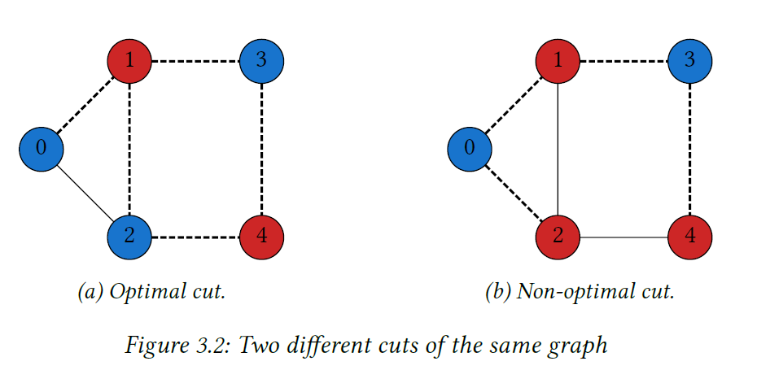

# Quadratic unconstrained Binary Optimization Problems

## The Max-Cut problem and the Ising model

When you are given a graph, you are essentially given some elements, which we will refer to as vertices, and some connections between pairs of these vertices, which we will call edges.

Figure: Example of a graph

That is, it is a partition of the graph's vertices into two complementary sets S and T, such that the number of edges between S and T is as large as possible. Finding such a cut is known as the max-cut problem.

### Problem formulation

we can formulat the Max-Cut problem as combinatorial optimization problem with no reference whatsoever to graphy, edges, or vertices. To do that, we assign vairable $z_i$ to each vertix $i=0, \cdots, n-1$ of the graph. Variables $z_i$ will take value $1$ or $-1$. Each assignment of values to the variables determines a cut: {==vertices whose variable take value $1$ will be in one set and vertices whose variables take value $-1$ will be in the other one.==} 

The key observation to formulate Max-Cut as a combinatorial optimization problem is that {==**edge is cut if and only if $z_{j}z_{k}=1$** This is because if two vertices are in the same set, then either $z_{j} = z_{k} = 1$ or $z_{j} = z_{k} = 1$ and, consequently, $z_{j}z_{k}=1$.==}

Thus, we can formulate our problem into

$$
\begin{array}{ll}
    \text{Minimize} &\sum_{(j,k)\in E} z_{j}z_{k}\\
    \text{subject to} & z_{j} \in \{-1,1\}, \ j = 0, \cdots,n-1.
\end{array}
$$

From the figure we showed above, we can write

$$
\begin{array}{ll}
    \text{Minimize} &\sum_{(j,k)\in E} z_{0}z_{1}+z_{0}z_{2}+z_{1}z_{2}+z_{1}z_{3}+z_{2}z_{4}+z_{3}z_{4}\\
    \text{subject to} & z_{j} \in \{-1,1\}, \ j = 0, \cdots,4.
\end{array}
$$

The cut $z_{1}=z_{4}=-1$, $z_{0}=z_{2}=z_{3}=1$, which achieves a optimal value of -4. The cut $z_{0}=z_{3}=-1$, $z_{1}=z_{2}=z_{4}=1$, on the other hand, has a value of $-2$, which we already know that its not optimal value.

We can formulate the above graph as the follwoing:

$$
\begin{array}{ll}
    \text{Minimize} & z_{0}z_{1}+z_{0}z_{2}+z_{1}z_{0}+z_{1}z_{2}+z_{1}z_{4}+z_{2}z_{0}+z_{2}z_{1}+z_{2}z_{3}\\
     & +z_{3}z_{4}+z_{3}z_{5}+z_{4}z_{5}\\
    \text{subject to} & z_{j} \in \{-1,1\}, \ j = 0, \cdots,4.
\end{array}
$$

### The Ising model

.

The total energy of the system is given by a quantity called the {==**Hamiltonian**==} function defined by

$$
-\sum_{j,k}{J_{jk}}z_{j}z_{k}-\sum_{j}h_{j}z_{j}
$$

where the coefficients $J_{jk}$ represent the interaction between particles $j$ and $k$ and the coefficicents $h_j$ represent the influence of an external magnetic field on particle $j$.

{==Finding the state of minimum energy of the system consists in obtaining a spin configuration for which the Hamiltonian function attains its minimum value==}. As you can easily check that if $J_{jk}$ coefficients are $-1$ and all the $h_j$ coefficients are $0$, the problem is exactly the same as the max-cut problem.

That is, we can formulate the Ising showed above like as

$$
\begin{array}{ll}
    \text{Recall:} & \color{red}{-\sum_{j,k}{J_{jk}}z_{j}z_{k}}\color{blue}{-\sum_{j}h_{j}z_{j}}\\
    \text{Minimize} & \color{red}{z_{0}z_{1}-2z_{1}z_{2}+z_{2}z_{3}-3z_{0}z_{4}+z_{4}z_{5}+z_{1}z_{5}}\\
                    & \color{red}{-2z_{5}z_{6}+z_{2}z_{6}+z_{6}z_{7}-3z_{3}z_{7}-3z_{4}z_{8}+z_{8}z_{9}}\\
                    & \color{red}{z_{5}z_{9}-2z_{9}z_{10}+z_{6}z_{10}+z_{10}z_{11}-7z_{3}z_{11}}\\
                    & \color{blue}{-z_{0}-z_{1}-z_{2}-z_{3}-z_{4}-z_{5}-z_{6}-z_{7}-z_{8}}\\
                    & \color{blue}{-z_{9}-z_{10}-z_{11}}\\
    \text{subject to} & z_{j} \in \{-1,1\}, \ j = 0, \cdots,11.
\end{array}
$$

## Formulating optimization problems the quantum way

Taking above very simple Max-Cut problem as an example. To transform a Max-Cut problem in to a quantum one, we have to use $Z$ matrix. Since we know that

$$
\begin{array}{ll}
\langle0|Z|0\rangle =
    \begin{pmatrix}1 & 0 \end{pmatrix}
    \begin{pmatrix}1 & 0\\ 0 & -1 \end{pmatrix}
    \begin{pmatrix}1 \\ 0 \end{pmatrix}=1, &
\langle1|Z|1\rangle =
    \begin{pmatrix}0 & 1 \end{pmatrix}
    \begin{pmatrix}1 & 0\\ 0 & -1 \end{pmatrix}
    \begin{pmatrix}0 \\ 1 \end{pmatrix}=-1 
\end{array} 
$$

Now, consider the tensor product $Z\otimes Z\otimes I$ and basis state $|010\rangle$. 

$$
\begin{array}{ll}
\langle 010 |Z\otimes Z\otimes I|010\rangle & = \langle 010|(Z|0\rangle \otimes Z|1\rangle\otimes I|0\rangle)\\
   & = \langle0|Z|0\rangle \langle1|Z|1\rangle \langle0|I|0\rangle \\
   & = 1 \cdot (-1) \cdot 1 = -1
\end{array}
$$

-   $|010\rangle$ represents a cut where vertices $0$ and $2$ are grouped together and vertex is assigned to the other.
-   The product $\langle 010 |Z\otimes Z\otimes I|010\rangle$ evaluates to $-1$ means that edge $(0,1)$ has extremes in dfferent sets of the cut since we have used $Z\otimes Z\otimes I$, having $Z$ operators acting on qubits $0$ and $1$.
-   We usually denote $Z\otimes Z\otimes I$ as $Z_{0}Z_{1}$ and, following this convention, we could have, for instance
    
    $$
    \langle 010|Z_{0}Z_{2}|010\rangle = \langle0|Z|0\rangle\langle1|I|1\rangle\langle0|Z|0\rangle = 1 \cdot 1 \cdot 1 = 1
    $$

    since the edge (0,2) is not cut with this particular case.
-   Also, we can expand this to 

    $$
    \langle x|(Z_{0}Z_{1}+Z_{0}Z_{2})|x\rangle = \langle x|Z_{0}Z_{1}|x\rangle+\langle x|Z_{0}Z_{2}|x\rangle
    $$

    due to linearity.

This is also applies to all basis state $|x\rangle$ with $x \in \{000,001,\cdots,111\}$, so $\langle x|Z_{j}Z_{k}|x\rangle$ will be $-1$ if the edga $(j,k)$ is cut under an assignment $x$.

!!! note Eigenvector and Eigenstate
    For any basis state $|x\rangle$, it holds that either $Z_{j}Z_{k}|x\rangle = |x\rangle$ or $Z_{j}Z_{k}|x\rangle = -|x\rangle$. This indicates that $|x\rangle$ is an ***eigenvector*** of $Z_{j}Z_{k}$ with ***eigenvalue*** either $1$ or $-1$. Thus, for $x\neq y$ we have 
    $$
    \langle y | Z_{j}Z_{k} |x\rangle = \pm \langle y|x\rangle = 0.
    $$

Consequently, since we can write $|\psi \rangle$ as $\psi \rangle = \sum_{x}a_{x}|x\rangle$, from linearity, we have

$$
\begin{array}{ll}
\langle \psi|Z_{j}Z_{k}|\psi\rangle & = \bigg( \sum_{y}a_{y}^{*}\langle y| \bigg) Z_{j}Z_{k} \bigg( \sum_{x}a_{x}\langle x| \bigg)\\
    & = \sum_{y}\sum_{x}a_{y}^{*}a_{x}\langle y|Z_{j}Z_{k}|x\rangle\\
    & = \sum_{x}|a_{x}|^{2}\langle x|Z_{j}Z_{k}|x\rangle,
\end{array}
$$

where $a_{x}^{*}a_{x} = |a_{x}|^{2}$.

Hence, we transform $\langle x|(Z_{0}Z_{1}+Z_{0}Z_{2})|x\rangle$ to

$$
\begin{array}{ll}
\langle x|(Z_{0}Z_{1}+Z_{0}Z_{2})|x\rangle & = \langle\psi|Z_{0}Z_{1}|\psi\rangle\langle\psi|Z_{0}Z_{2}|\psi\rangle\\
    & = \sum_{x}|a_{x}|^{2}\langle x|Z_{0}Z_{1}|x\rangle + \sum_{x}|a_{x}|^{2}\langle x|Z_{0}Z_{2}|x\rangle \\
    & = \sum_{x}|a_{x}|^{2}\langle x|Z_{0}Z_{1}+Z_{0}Z_{2}|x\rangle.
\end{array}
$$

Since we know $\sum_{x}|a_{x}|^{2} = 1$ (Total probability sum is 1) and the every $|a_{x}|^{2}$ is non-negative, 

$$
\begin{array}{ll}
\sum_{x}|a_{x}|^{2}\langle x|Z_{0}Z_{1}+Z_{0}Z_{2}|x\rangle & \leq \sum_{x}|a_{x}|^{2}\langle x_{\text{min}}|Z_{0}Z_{1}+Z_{0}Z_{2}|x_{\text{min}}\rangle\\
    & = \langle x_{\text{min}}|Z_{0}Z_{1}+Z_{0}Z_{2}|x_{\text{min}}\rangle \sum_{x}|a_{x}|^{2}\\
    & = \langle x_{\text{min}}|Z_{0}Z_{1}+Z_{0}Z_{2}|x_{\text{min}}\rangle
\end{array}
$$

where $|x_{\text{min}}\rangle$ is a basis state $x \in \{000,001,\cdots,111\}$ for which $x_{\text{min}}|Z_{0}Z_{1}+Z_{0}Z_{2}|x_{\text{min}}$ is minimum and $x_{\text{min}}$ represents a maximum cut.

Therefore, we rewite our problem in to a quantum form as 

$$
\begin{array}{l}
\text{minimize} \ \ \ \ \langle x_{\text{min}}|Z_{0}Z_{1}+Z_{0}Z_{2}|x_{\text{min}}\rangle = \sum_{x}|a_{x}|^{2}\langle x|Z_{0}Z_{1}+Z_{0}Z_{2}|x\rangle\\
\text{where} |\psi\rangle \text{is taken from the set of quantum state on 3 qubits.}
\end{array}
$$

This, in constrast to the previous example, we are minimizing overall possible quantum states.

For any number of qubits and any sum of tensor products $Z_{j}Z_{k}$, if we have a graphy with set of vertices $V$, of size $n$, and set of edge $E$, we can rewrite the Max-Cut problem for the graph as:

$$
\begin{array}{l}
\text{minimize} \ \ \ \ \sum_{(j,k)\langle \psi|Z_{j}Z_{k}|\psi\rangle\in E}\\
\text{where} |\psi\rangle \text{is taken from the set of quantum state on 3 qubits.}
\end{array}
$$

We said that the matrix

$$
\sum_{(j,k)\in E}Z_{j}Z_{k}
$$

are **Hamiltonian**, as the matrix equals to its conjugate tranpose. Hamiltonian has **real eigenvalues** and being able to form an **orthonomal basis withe their eigenvector**. The equantity 

$$
\langle \psi| \bigg( \sum_{(j,k)\in E}Z_{j}Z_{k} \bigg)|\psi \rangle = \sum_{(j,k)\in E}\langle \psi|Z_{j}Z_{k}|\psi\rangle,
$$

which we usually refer to the **expectation value** of $\sum_{(j,k)\in E}Z_{j}Z_{k}$, attains its minimum value on one of those eigenvectors, aclled the **ground state**.

## Moving from Ising to QUBO and back
Let's say taht you are given a set of integers $S$ and $T$, and you are asked whether there is any subset of $S$ whose sum is $T$. For example, if $S = \{1,3,4,7,-4\}$ and $T = 6$, then the answer is affirmative because $3+7-4 = 6$. If $S = \{2,-2,4,8,-12 \}$ and $T=1$, the answer is **negative** because all the numbers in the set are even and they cannot add up to an odd number.

This problem is so called the **Subset Sum** problem and known for a $N$**-complete**. It turns out that we can **reduce** the Subset Sum problem to finding a spin configuration of minimal energy for any Ising model.

Let's consider a binery values instead of $1$ and $-1$ in this case. if we are given a case $S = {a_{0},\cdots,a_{m}}$ and an integer $T$, we can define binary variable $x_j, j=0,\cdots,m$ and consider

$$
c(x_{0},x_{1},\cdots,x_{m}) = (a_{0}x_{0}+a_{1}x_{1}+ \cdots +a_{m}x_{m} - T)^{2}
$$

and we can find the positive answer if and only if we can find the binary values $x_j, j=0,\cdots, m$ such that $c(x_{0},x_{1}, \cdots, x_{m}) = 0$.

For example, if we are given a set of $S = \{1,4,-2 \}$ and $T=2$, we can formulate the question as:

$$
\begin{array}{ll}
\text{minimize} & (x_{0}+4x_{1}-2x_{2}-2)^{2}\\
\text{subject to} & x_{j}\in \{0,1\}, \ j = 0, \cdots,m
\end{array}
$$

and we have to expand $(x_{0}+4x_{1}-2x_{2}-2)^{2}$ to obtain the epxression to be optimized. For this case, we need $x_{0}, x_{1} = x_{2} = 1$ to find a optimal solution.

Notice that, in all of these cases, the function $c(x_{0},x_{1},\cdots,x_{m})$ that we need to minimize is a polynomial of degree $2$ on the binary variables $x_j$. We thus generalize this setting and define {==**Quadratic Unconstrained Binary Optimization (QUBO)**==} problems.

$$
\begin{array}{ll}
\text{minimize} & q(x_{0},\cdots,x_{m})\\
\text{subject to} & x_{j}\in \{0,1\}, \ j = 0, \cdots,m
\end{array}
$$

where $q(x_{0},\cdots,x_{m})$ is a quadratic polynomial on the $x_j$ variables.

!!! note 
    We are calling this QUBO since we are minimizing quadratic expressions over binary variables with no restrictions (every combinations of ones and zeros are acceptable).

For an Ising problem, if you want to minimize:

$$
-\sum_{j,k}J_{j,k}z_{j}z_{k} - \sum_{j} h_{j}z_{j}
$$

with some variables $z_{j}$, $j = 0,\cdots,m$, taking values $1$ or $-1$, you can define new variables $x_{j} = (1-z_{j})/2$. $x_{j}$ will be $0$ when $z_{j}$ is $1$, and $1$ when $z_{j}$ is $-1$.

On the other hand, you can define a new variable called $z_{j} = 1-2x_{j}$, which leads you to a quadratic polynomial in the binary variable $x_j$ that takes exactly the same values as the energy function of the original Ising model. If you minimize the polynomical for the variables $x_{j}$, you can then recover the spin value $z_{j}$ that achieve the minimal energy. As you may wonder, you can also use $z_{j} = 2x_{j}-1$ to transform Ising problem into QUBO.

For example, if the Icing energy is given by $\frac{1}{2}z_{0}z_{1}+z_{2}$, then, under the transformation $z_{j} = 1-2x_{j}$, the corresponding QUBO problem will be (by substitute $z_{0} = 1-2x_{0}$, $z_{1} = 1-2x_{1}$, and $z_{2} = 1-2x_{2}$ in to Ising energy $\frac{1}{2}z_{0}z_{1}+z_{2}$.):

$$
\begin{array}{ll}
\text{minimize} & -2x_{0}x_{1}+x_{0}+x_{1}-2x_{2}+\frac{1}{2}\\
\text{subject to} & x_{j}\in \{0,1\}, \ j =0, 1, 2.
\end{array}
$$

## Combinatorial optimization problems with the QUBO model
### Binary linear programming

**Binary linear programming** problems involve optimizaing a linear function on binary variables subject to linear constraints. 

$$
\begin{array}{ll}
\text{minimize} & c_{0}x_{0}+c_{1}x_{1}+\cdots+c_{m}x_{m}\\
\text{subject to} & Ax \leq b, \\
& x_{j}\in \{0,1\}, \ j = 0,\cdots,m,
\end{array}
$$

where $c_{j}$ are integer coefficients, $A$ is an integer matrix, $x$ is the transpose of $(x_{0},\cdots,x_{m})$, and $b$ is an integer column vector.

For an example:

$$
\begin{array}{ll}
\text{minimize} & -5x_{0}+3x_{1}-2x_{2} \\
\text{subject to} & x_{0}+x_{2} \leq 1, \\
                & 3x_{0} - x_{1}+3x_{2} \leq 4,\\
                & x_{j}\in \{0,1\}, \ j = 0, 1, 2,
\end{array}
$$

!!! note
    Binary linear programming (**zero-one programming**) is $NP$-hard.

To write a binary linear program in QUBO, we need to perfrom some transformations. The first one is to convert the inequality constraints into equality constraints by adding **slack variables**. In the previous example, we have inquality constraints $x_{0}+x_{2} \leq 1$ and $3x_{0} - x_{1}+3x_{2} \leq 4$. We know that the minimum value for the left hand side of the first equation is 0 and -1 for the left hand side of the second equation. The goal here is to add slack variable(s) to make the equation equal when left hand side of the original inequality has its minimum. To add **non-negative** slack variable(s), we can modify the first inequality into:

$$
x_0 + x_2 + y_0 = 1
$$

and since the minimum of the second inequality is when $x_0 = x_2 =0$ and $x_1 = 1$, $3x_{0} - x_{1}+3x_{2} = -1$. We need to add at least 3 different slaock variables with a proper coefficient to make $3x_{0} - x_{1}+3x_{2} = 5$. Therefore,

$$
3x_0-x_1+3x_2+y_1+2y_2+2y_3 = 4
$$

can be  satisfied if and only if $3x_{0} - x_{1}+3x_{2} \leq 4$ can be satified. Now, we rewrite the original problem as,

$$
\begin{array}{ll}
\text{minimize} & -5x_{0}+3x_{1}-2x_{2} \\
\text{subject to} & x_0 + x_2 + y_0 = 1, \\
                & 3x_0-x_1+3x_2+y_1+2y_2+2y_3 = 4,\\
                & x_{j}\in \{0,1\}, \ j = 0, 1, 2,\\
                & y_{j}\in \{0,1\}, \ j = 0, 1, 2, 3
\end{array}
$$

Next, we introduce **penalty terms** in the expression that we are trying to minimize. For that, we use an integer $B$ (for which we will select a concrete value later on) and consider the problem,

$$
\begin{array}{ll}
\text{minimize} & -5x_{0}+3x_{1}-2x_{2} + B(x_0 + x_2 + y_0-1)^2\\
                & + B(3x_0-x_1+3x_2+y_1+2y_2+2y_3-4)^2 \\
\text{subject to} & x_{j}\in \{0,1\}, \ j = 0, 1, 2,\\
                  & y_{j}\in \{0,1\}, \ j = 0, 1, 2, 3,
\end{array}
$$

which is *already in QUBO form*.

Let's us breakdown why and how to choose the $B$. 

1. First, $B(x_0 + x_2 + y_0-1)^2$ term will penalizes solutions where the sum of the $x_0, x_2, and y_0$ does not equal $1$.
2. Second, $B(3x_0-x_1+3x_2+y_1+2y_2+2y_3-4)^2$ term will pernalizes solutions where this sum does not equal to $4$, which means, not a minimim solution.
3. The choose of $B=11$ is based on the range of the solution, which, in this case is $[-7,3]$. We choose $11 > 10$ (range of the solution).
4. What if I don't know the exact range? 
    - You can use $B > \alpha \times \beta $
    - where $\alpha$ is the largest coefficient in the objective, $\beta$ is the number of variable in penalty terms. In this case, $B > 5 \times 7 = 35$.
    - Poper turning.

Re-write our QUBO,

$$
\begin{array}{ll}
\text{minimize} & -5x_{0}+3x_{1}-2x_{2} + 11(x_0 + x_2 + y_0-1)^2\\
                & + 11(3x_0-x_1+3x_2+y_1+2y_2+2y_3-4)^2 \\
\text{subject to} & x_{j}\in \{0,1\}, \ j = 0, 1, 2,\\
                  & y_{j}\in \{0,1\}, \ j = 0, 1, 2, 3,
\end{array}
$$

**Integer linear programming** is a generalization of binary linear programming where non=negative variables are used instead of $0$ and $1$. For example, we have a constraint

$$
2a_0 + 3a_1 \leq 10
$$

where, we can replace $a_0$ with $x_0 + 2x_1 + 4x_2$ ($a_{0} \leq 5$) and $a_1$ with $x_3 + 2x_4$ ($a_{1} \leq 3$) where $x_{j} \in \{0,1\}$. By doing this, we successfully transform the integer linear programming to a QUBO problem. There is a general rule that tells you how many $x_{j}$ you need. For the fist constraint, $a_{0} \leq 5$, we need $j$ of $x_{j}$ such that $2^{j} - 1 \geq 5$. by solving this, we can get $j=3$, in the same fashion, we can get $j=2$ to satisfy $2^{2}-1 \geq 3$.

### The Knapsack problem
It is straightforward to write the Knapsack problem as a binary linear problem. The Knapsack problem is a $NP$-hard problem. We need to define binary variables $x_j$, $j=0,\cdots,m$ that indicate **whether we choose object $j$ (x_j = 1) or not (x_j = 0)**.

$$
\begin{array}{ll}
\text{minimize} & -(c_{0}x_{0} + c_{1}x_{1} + \cdots + c_{m}x_{m})\\
\text{subject to} & w_{0}x_{0} + w_{1}x_{1}+ \cdots + w_{m}x_{m} \leq W,\\
                & x_{j}\in \{0,1\}, \ j = 0, \cdots, m,
\end{array}
$$

where $c_j$ are the object values, $w_j$ are their weights, and $W$ is the maximum weight of the knapsack. Since we are asking the maximum, so we are now minimizing the negative value. Let's write a Knapsack problem as a binary linear program.

$$
\begin{array}{ll}
\text{minimize} & -(3x_{0} + 1x_{1} + 7x_{2} + 7x_{3})\\
\text{subject to} & 2x_{0} + x_{1}+ 5x_{1} + 4x_{1} \leq 8,\\
                & x_{j}\in \{0,1\}, \ j = 0, 1, 2,3, 
\end{array}
$$

which has values of $3,1,7,7$ and weight $2,1,5,4$ with the maximum weight of $8$.

### Graph coloring

{==In its simplest form, it is a way of coloring the vertices of a graph such that no two adjacent vertices are of the same color.==}

In the graph coloring problem, we are given a graph and we are asked to assign a color to each vertex in such a way that vertices that are connected by and edge (also called **adjacent**) receive different colors. We also are asked to do this using the minimum possible numebr of colors or using no mroe than a given number of different colors. If we can color a graph with $k$ colors, we say that it is $k$-**colorable.** The minimum number of colors needed to color a graph is called its **chromatic number**.

Let's get start to formulate the graph coloring problem to a QUBO framework!

1. first, we have to define some binary variables, let's say we have $m$ vertices from $j=0,\cdots,m$, and $k-1$ of different colors with $l$th on each vertices.
To ensure each vertice $j$ only recieve **one** color $l$, we can have the following condition:

$$
\sum_{l=0}^{k-1}x_{jl} = 1.
$$

For an example, this ensure that every $j$-th vertice only receive one $l$-th color. We also have to consider for every vertice $j$, there must exist $l$ such that $x_{jl}=1$ and such that $x_{jh}=0$ for any $h\neq l$. 

Now, we can impose a constraint that adjacent vertice are not assigned the same color. We know that if two vertices $j$ and $h$ receive the same color $l$, then we would have $x_{jl}X_{hl}=1$. Therefore, the sum of any $j$ and $h$ must be $0$, that is,

$$
\sum_{l=0}{k-1}x_{jl}x_{hl} = 0.
$$

Then we can write this graph coloring problem into a QUBO framework as,

$$
\begin{array}{ll}
\text{minimize} & \sum_{j=0}^{m}\bigg(\sum_{l=0}^{k-1}x_{jl}-1\bigg)^{2} + \sum_{(j,h)\in E}\sum_{l=0}^{k-1}x_{jl}x_{hl}\\
\text{subject to} & x_{jl}\in \{0,1\}, \ j = 0,\cdots,m, \ l = 0,\cdots,k-1.
\end{array}
$$

We added $-1$ term to ensure when the result deviates from 1, our framework impose a penalty on it. And we don't need to square the second term since they are always non-negative.

### The Traveling Salesperson Problem
The Traveling salesperon problem is one of the most famous problems in combinatorial optimization. The problem is wasy to state: you need to find a route that goes through each of the cities in a given set once and only once while minimizing some global quantity (distance traveled, time spent, total cost...). 

First, let's deal with visiting each vertex  $j$ once and route $l$ once. Let's says we have $j$ vertices and $l$th different route. If vertex $j$ is the $l$-th in our travel route, the $x_{ij}$ will be $1$ and $x_{jh}$ will be $0$ for $h \neq l$. Thus, for every vertex $j$, we must impose a constraint,

$$
\sum_{l=0}^{m}x_{ij}=1
$$

because every vertex needs to be visited exactly once. Next, since we can only visit one city at a time for each $l$ travel route. 

$$
\sum_{j=0}^{m}x_{jl} = 1.
$$

If these two constraints are met, we will have a path that visit every vertex once and only once. However, that's not enough. Remember that we may want to minimize some global quantity (distance traveled, time spent, total cost...)? We need an expression that gives us that alobal quantity in terms of the $x_{jl}$ varialbles. Notice that an edge $(j,k)$ is used if and only if the vertices $j$ and $k$ are consecutive in the path. That is, if and only if there exists an $l$ such that $j$ is visited in position $l$ and $k$ is visited in position **$l+1$**. in that case, the cost of using the edge will be given by $w_{jk}x_{jl}x_{kl+1}$, because $x_{jl}x_{kl+1} =1$. and if $j$ and $k$ are not consecutive in the path, then $x_{jl}x_{kl+1} = 0$ for every $l$.

This ensure that we only visit $kl+1$ after vertiex $kl$, thus we calculate the cost(or any global quantity). As a resutl, the cost of our tour is given by,

$$
\sum_{l=0}^{m-1}\sum_{j=0}^{m}\sum_{k=0}^{m} w_{jk}x_{jl}x_{kl+1},
$$

then we conbine our constraints and get:

$$
\begin{array}{ll}
\text{minimize} & \sum_{l=0}^{m-1}\sum_{j=0}^{m}\sum_{k=0}^{m} w_{jk}x_{jl}x_{kl+1} + B_{1}(\sum_{l=0}^{m}x_{ij}-1)^{2}+B_{2}(\sum_{j=0}^{m}x_{jl}-1)^{2}\\
\text{subject to} & x_{jl}\in \{0,1\}, \ j = 0,\cdots,m, \ l = 0,\cdots,k-1.
\end{array}
$$

where penalty constants $B_1$ and $B_2$ is choosen so that any deviated results will generate large outcome in our cost function.

# Reference 
[1] By Miym - Own work, CC BY-SA 3.0, https://commons.wikimedia.org/w/index.php?curid=6002348