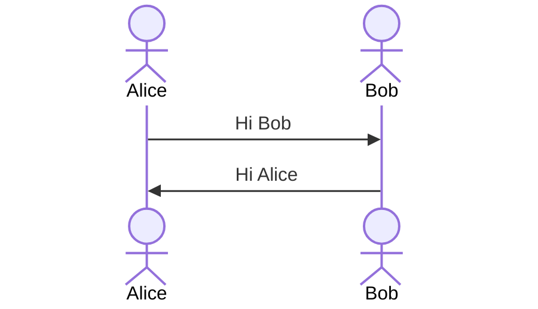

# Stream Cipher

## Key Topics 

## 2.1.1 Stream Cipher vs Block Ciphers

Stream Ciphers encrypt bits individually. This is achieved by adding a bit from a key stream to a plaintext bit. There are synchronous stream ciphers where the key stream depends only on the key, and asynchronous ones where the key stream also depends on the ciphertext. If the dotted line in Fig. 2.3 is present, the stream cipher is an asynchronous one. Most practical stream ciphers are synchronous ones and Sect. 2.3 of this chapter will deal with them. An example of an asynchronous stream cipher is the cipher feedback (CFB) mode introduced in Sect. 5.1.4.

Block ciphers encrypt an entire block of plaintext bits at a time with the same key. This means that the encryption of any plaintext bit in a given block depends on every other plaintext bit in the same block. In practice, the vast majority of block ciphers either have a block length of 128 bits (16 bytes) such as the advanced encryption standard (AES), or a block length of 64 bits (8 bytes) such as the data encryption standard (DES) or triple DES (3DES) algorithm. All of these ciphers are introduced in later chapters.

1.	In practice, in particular for encrypting computer communication on the Internet, block ciphers are used more often than stream ciphers.

2.	Because stream ciphers tend to be small and fast, they are particularly relevant for applications with little computational resources, e.g., for cell phones or other small embedded devices. A prominent example for a stream cipher is the A5/1 cipher, which is part of the GSM mobile phone standard and is used for voice encryption. However, stream ciphers are sometimes also used for encrypting Internet traffic, especially the stream cipher RC4.

3.	Traditionally, it was assumed that stream ciphers tended to encrypt more efficiently than block ciphers. Efficient for software-optimized stream ciphers means that they need fewer processor instructions (or processor cycles) to encrypt one bit of plaintext. For hardware-optimized stream ciphers, efficient means they need fewer gates (or smaller chip area) than a block cipher for encrypting at the same data rate. However, modern block ciphers such as AES are also very efficient in software. Moreover, for hardware, there are also highly efficient block ciphers, such as PRESENT, which are as efficient as very compact stream ciphers. 

### 2.1.2 Encryption and Decryption with Stream Ciphers

Definition 2.1.1 Stream Cipher Encryption and Decryption 

**Encryption:** $$ y_i = e_{s_i}(x_i) \equiv x_i + s_i\mod 2. $$

**Decryption:** $$ x_i = d_{s_i}(y_i) \equiv y_i + s_i\mod 2. $$

Since encryption and decryption functions are both simple additions modulo 2, we can depict the basic operation of a stream cipher as shown in Fig. 2.4. Note that we use a circle with an addition sign as the symbol for modulo 2 additions.

## Stream Cipher Example

1.	Encryption and decryption are the same functions!
2.	Why can we use a simple modulo 2 addition as encryption?
3.	What is the nature of the key stream bits si?

**Why Is Modulo 2 Addition a Good Encryption Function?**

If we do arithmetic modulo 2, the only possible values are 0 and 1 (because if you divide by 2, the only possible remainders are 0 and 1). Thus, we can treat arithmetic modulo 2 as Boolean functions such as AND gates, OR gates, NAND gates, etc. Let’s look at the truth table for modulo 2 addition:

$$ 
\begin{array}{|c|c|c|}
\hline
x_i & s_i & y_i \equiv x_i + s_i\mod 2 \\
\hline
0 & 0 & 0 \\
0 & 1 & 1 \\
1 & 0 & 1 \\
1 & 1 & 0 \\
\hline
\end{array}
$$ 

This should look familiar to most readers: It is the truth table of the exclusive-OR, also called XOR, gate. This is in important fact: Modulo 2 addition is equivalent to the XOR operation. The XOR operation plays a major role in modern cryptography and will be used many times in the remainder of this book.

$$
\text{XOR Truth Table:} \\
\begin{array}{|c|c|c|}
\hline
A & B & A \oplus B \\
\hline
0 & 0 & 0 \\
0 & 1 & 1 \\
1 & 0 & 1 \\
1 & 1 & 0 \\
\hline
\end{array}
$$

Depending on the key bit, the ciphertext $y_i$ is either a zero $(s_i =0)$ or one $(s_i =1)$. If the key bit si behaves perfectly randomly, i.e., it is unpredictable and has exactly a 50% chance to have the value 0 or 1, then both possible ciphertexts also occur with a 50% likelihood. Likewise, if we encrypt the plaintext bit xi = 1, we are on line 3 or 4 of the truth table. We just observed that the XOR function is perfectly balanced, i.e., by observingan output value, there is exactly a 50% chance for any value of the input bits. This distinguishes the XOR gate from other Boolean functions such as the OR, AND or NAND gate. Moreover, AND and NAND gates are not invertible.

### Example. 
Alice wants to encrypt the letter `A`, where the letter is given in ASCII code. The ASCII value for `A` is $65_{10} = 1000001_2$. Let's further more assume that the first key stream bits are $(S_0,..., S_6) = 0101100.$

$$
\begin{array}{|c|c|c|}
\hline
Alice & Oscar & Bob \\
\hline
x_0,...,x_6 = 1000001 = A &  &  \\
\oplus &  &  \\
s_0,...,s_6 = 0101100 &  &  \\
y_0,...,y_6 = 1101101 = m &   &  \\
 & m = 1101101 &  \\
 & & y_0,...,y_6 = 1101101 = m \\
 & & \oplus \\
 & & s_0,...,s_6 = 0101100 \\
 & & x_0,...,x_6 = 1000001 = A \\
\hline
\end{array}
$$

Note that the encryption by Alice turns the uppercase `A` into the lower case letter m. Oscar, the attacker who eavesdrops on the channel, only sees the ciphertext letter m. Decryption by Bob with the same key stream reproduces the plaintext A again.

**What Exactly Is the Nature of the Key Stream?**

It turns out that the generation of the values $si$, which are called the *key stream*, is the central issue for the security of stream ciphers. In fact, the security of a stream cipher *completely depends on the key stream*. The key stream bits $si$ are not the key bits themselves. {==**Generating the key stream is pretty much what stream ciphers are about. This is a major topic and is discussed later in this chapter.**==} However, we can already guess that a central requirement for the key stream bits should be that they appear like a random sequence to an attacker.

### 2.2.1 Random Number Generators
First learn about the three types of random number generators (RNG) that are important for us.

1. Ture Random Number Generators (TRNG)

    *True random number generators (TRNGs)* are characterized by the fact that their output cannot be reproduced. For instance, if we flip a coin 100 times and record the resulting sequence of 100 bits, it will be virtually impossible for anyone on Earth to generate the same 100 bit sequence. In cryptography, TRNGs are often needed for generating session keys, which are then distributed between Alice and Bob, and for other purposes.

2. (General) Pseudorandom Number Generators (PRNG)

    *Pseudorandom number generators (PRNGs)* generate sequences which are computed from an initial seed value. A generalization of this are generators of the form $si+1 = f (si, si−1, . . . , si−t )$, where $t$ is a fixed integer. A popular example is the **linear congruential generator**:
$$
s_0 = seed
$$
$$
s_{i+1} \equiv a s_{si} + b\mod m, \ i = 0, 1,...
$$
where $a,b,m$ are integer constants. Here are the example of the Pseudorandom Number Generators (PRNG):

$$
\begin{array}{|c|c|}
\hline
i & S_i \\
\hline
0 & 1  \\
1 & (3 \cdot 1+1) = 4 \mod 7 = 4\\
2 & (3 \cdot 4=1) = 13\mod 7 = 6\\
3 & (3 \cdot 6+1) = 19 \mod 7 = 5\\
4 & (3 \cdot 5+1) = 16\mod 7 = 2\\
\hline
\end{array}
$$

Note that PRNGs are not random in a true sense because they can be computed and are thus completely deterministic. A widely used example is the rand() function used in ANSI C. It has the parameters:

$$
s_0 = 12345
$$

$$
s_{i+1} \equiv 1103515245 s_{si} + 12345\mod 2^{31}, \ i = 0, 1,...
$$

A common requirement of PRNGs is that they possess good statistical properties, meaning their output approximates a sequence of true random numbers. There are many mathematical tests, e.g., the [chi-square test](https://en.wikipedia.org/wiki/Chi-squared_test), which can verify the statistical behavior of PRNG sequences. For instance, many types of simulations or testing, e.g., of software or of VLSI chips, need random data as input. That is the reason why a PRNG is included in the ANSI C specification.

3.  Cryptographically secure Pseudorandom Number Generators( CSPRNG)

    *Cryptographically secure pseudorandom number generators (CSPRNGs)* are a special type of PRNG which possess the following additional property: A CSPRNG is PRNG which is unpredictable.A more exact definition is that given n consecutive bits of the key stream, there is no polynomial time algorithm that can predict the next bit sn+1 with better than 50% chance of success. Another property of CSPRNG is that given the above sequence, it should be computationally infeasible to compute any preceding bits si−1, si−2, . . .. Note that the need for unpredictability of CSPRNGs is unique to cryptography. As a consequence, the distinction between PRNG and CSPRNG and their relevance for stream ciphers is often not clear to non-cryptographers. Almost all PRNG that were designed without the clear purpose of being stream ciphers are not CSPRNGs.

### The One-Time Pad
!!! note "Definition Unconditional Security"

    *A cryptosystem is unconditionally or information-theoretically secure if it cannot be broken even with infinite computational resources*

Unconditional security is based on information theory and assumes no limit on the attacker’s computational power. All this said, we now show a way to build an unconditionally secure cipher that is quite simple. This cipher is called the One-Time Pad.
