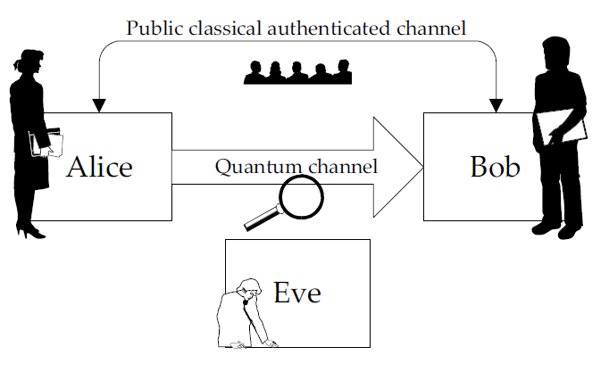

When the medium is of atomic scale, the carried information behaves quite differently, and all the features specific to quantum mechanics must be translated into an information-theoretic language, giving rise to quantum information theory. The first application of quantum information theory was found by Wiesner in the late sixties. He proposed using the spin of particles to make unforgeable bank notes. Roughly speaking, the spin of a particle obeys the uncertainty principle: an observer cannot get all the information about the spin of a single particle; he would irreversibly destroy some part of the information when acquiring another part.

In a classical computer, every computation is a combination of zeroes and ones (i.e., bits). At a given time, a bit can either be zero or one. In contrast, a qubit, the quantum equivalent of a bit, can be a zero and a one at the same time

Following the tracks of Weisner’s idea, Bennett and Brassard proposed in 1984 a protocol to distribute secret keys using the principles of quantum mechanics called quantum cryptography or more precisely quantum key distribution. By again exploiting the counterintuitive properties of quantum mechanics, they developed a way to exchange a secret key whose secrecy is guaranteed by the laws of physics. Following the uncertainty principle, an eavesdropper cannot know everything about a photon that carries a key bit and will destroy a part of the information. Hence, eavesdropping causes errors on the transmission line, which can be detected by Alice and Bob.

Quantum key distribution is not only based on the principles of quantum physics, it also relies on classical information theory. The distributed key must be both common and secret. First, the transmission errors must be corrected, whether they are caused by eavesdropping or by imperfections in the setup. Second, a potential eavesdropper must know nothing about the key. To achieve these two goals, techniques from classical information theory, collectively denoted as secret-key distillation, must be used.

## A first tour of quantum key distribtion (QKD)
Quantum key distribution (QKD) is a technique that allows two parties, conventionally called Alice and Bob, to share a common secret key for cryptographic purposes. To ensure the confidentiality of communications, Alice and Bob agree on a common, yet secret, piece of information called a key. Encryption is performed by combining the message with the key in such a way that the result is incomprehensible by an observer who does not know the key.

### Let us detail further how QKD works
First, how is the confidentiality of the key ensured? If an eavesdropper, conventionally called Eve, tries to determine the key, she will be detected. The legitimate parties will then discard the key, while no confidential information has been transmitted yet. If, on the other hand, no tapping is detected, the secrecy of the distributed key is guaranteed.

Quantum key distribution requires a transmission channel on which quantum carriers are transmitted from Alice to Bob. In theory, any particle obeying the laws of quantum mechanics can be used. In practice, however, the quantum carriers are usually photons, the elementary particle of light, while the channel may be an optical fiber (e.g., for telecommunication networks) or the open air (e.g., for satellite communications).

Alice encoding only zeroes and ones. The whole point is that an eavesdropper cannot predict any of the transmitted bits. During the tranmission between Alice and Bob, Eve might listen to the quantum channel and therefore spy on potential secret key bits This does not pose a fundamental problem to the legitimate parties, as the eavesdropping is detectable by way of transmission errors. Furthermore, the secret-key distillation techniques allow Alice and Bob to recover from such errors and create a secret key out of the bits that are unknown to Eve.

**After the transmission, Alice and Bob can compare a fraction of the exchanged key to see if there are any transmission errors caused by eavesdropping.**

**Quantum key distribution comprises a quantum channel and a public classical authenticated channel.**

### Encoding random bits using qubits
We will first introduce a QKD tool [BB84](https://en.wikipedia.org/wiki/BB84#:~:text=BB84%20is%20a%20quantum%20key,the%20first%20quantum%20cryptography%20protocol.). In BB84, Alice encodes random (classical) bits, called key elements, using a set of four different qubits.

The 0 can be encoded with either $\lvert 0 \rangle$ or $\lvert + \rangle = \frac{\lvert 0 \rangle + \lvert 1 \rangle}{\sqrt{2}}$. The bit 1 can be encoded with $\lvert 1 \rangle$ or $\lvert - \rangle = \frac{\lvert 0 \rangle - \lvert 1 \rangle}{\sqrt{2}}$.

When the photon arrives at bob's station, he would like to decode what Alice sent. Here is what he has to do:

1. Perform a *measurement*. However, the laws of quantum mechanics prohibit Bob from determining the qubit **completely**. Actually, it's impossible to measure the exact coefficient of $\alpha$ and $\beta$ of $\alpha \lvert 0 \rangle + \beta \lvert 1 \rangle$ received from Alice.
2. Bob must choose **a pair of *orthogonal* qubits** and perform a measurement that distinguishes only among them. For an example we have two qubits $\lvert \psi \rangle = \alpha \lvert 0 \rangle + \beta \lvert 1 \rangle$ and $\lvert \psi' \rangle = \alpha' \lvert 0 \rangle + \beta' \lvert 1 \rangle$ such that $\alpha\alpha'^{*} + \beta\beta'^{*} = 0$, we said these two qubits are *orthogonal*.

### Detecting eavesdropping
The key feature for detecting eavesdropping is that the information is encoded in non-orthogonal qubits. Eve can, of course, intercept the quantum carriers and try to measure them. However, like Bob, she does not know in advance which set of carriers Alice chose for each key element. Like Bob, she may unsuccessfully distinguish between |0i and |1i when Alice encodes a bit as |+i or |−i, or vice versa.

Learn more about [Base shifting in BB84](../qcryptography/BB84.md)

**{==In quantum mechanics, measurement is destructive.(call out)==}**

Both Bob and Eve have the same difficulties in determining what Alice sent, since they do not know which encoding is used. But the situation is not symmetric in Bob and Eve: all the communications required to do the sifting are made over the classical authenticated channel. This allows Alice to make sure she is talking to Bob and not to Eve. So, the legitimate parties can guarantee that the sifting process is not influenced by Eve. Owing to this, Alice and Bob can select only the key elements which are correctly measured.

### Distilling a secret key