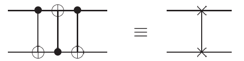

# 1.3 Quantum Computation

## Single and Multiple Qubtis
In order to tell what happens to s

## Measurements in bases other than the computational basis

## Quantum Circuits
Changes occurring to a quantum state can be described using the language of quantum
computation.

The circuit is to be read from left-to-right. Each line in the circuit represents a wire in the quantum circuit. This wire does not necessarily correspond to a physical wire; it may correspond instead to the passage of time, or perhaps to a physical particle such as a photon.

It's also conventional to assum that the state input to the circuit is a computational basis state, usually the state consisting of $\lvert 0 \rangle$s.

The figure accomplishes a simple but usaful task - it swaps the states
of the two qubits.

$$
\begin{array}{ll}
\lvert a, b \rangle \rightarrow \lvert a, a\oplus b \rangle \\
\lvert a, b \rangle \rightarrow \lvert a \oplus (a \oplus b), a\oplus b \rangle = \lvert b, a \oplus b \rangle \\
\lvert a, b \rangle \rightarrow \lvert b, (a\oplus b) \oplus b \rangle = \lvert b,a \rangle
\end{array} 
$$

remember XOR properties are:

$$
\begin{array}{ll}
a\oplus b = b\oplus a \ (Commutative)\\
a\oplus ( b \oplus c) = (a \oplus b) \oplus c \ (Associative)\\
a\oplus 0 = a \ (Identity)\\
a\oplus a = 0 \ (Self-Inverse)
\end{array} 
$$

where all additions are done modulo 2. The effect of the circuit, therefore, is to interchange the state of two qubits. To review logic gate, please see [Logic gate](../Math_Fundamentals/logic_gates.md) and more about [Quantum logic gate (Wiki)](https://en.wikipedia.org/wiki/Quantum_logic_gate) and [Quantum logic gate](../Math_Fundamentals/Quantum_logic_gates.md).

**Figure 1: Circuit swapping two qubits and equivalent schematic symbol notation for this common and useful circuit.**

There are a few features allowed in classical circuits that are not usually present in
quantum circuits.

1. We don’t allow ‘loops’, that is, feedback from one part of the quantum circuit to another; we say the circuit is acyclic.

2. Classical circuits allow wires to be ‘joined’ together, an operation known as `FANIN`, with the resulting single wire containing the bitwise `OR` of the inputs. Obviously this operation is not reversible and therefore not unitary, so we don’t allow `FANIN` in our quantum circuits.

3. The inverse operation, `FANOUT` , whereby several copies of a bit are produced is also not allowed in quantum circuits. **This is impossible in quantum mechanics**.

Thus, we introduce a so called *controlled-U* gate, which is a natural extension of the controlled-`NOT` gate. Such a single *single control qubit*, indicated by the line with the black dot, and `n target qubits`, indicated by the boxed $U$. If the control qubit is set to 0 then nothing happens to thetarget qubits. If the control qubit is set to 1 then the gate $U$ is applied to the target qubits.

**Figure 2: Controlled-$U$ gate**

**Figure 3: Two different representations for the controlled-$NOT$ gate**

Another important gate is the measurement. see figure 4 below.

**Figure 4: quantum circuit symbol for measurement**

### Quantum copying circuit

## Example: Bell states

## Example: Quantum Teleportation