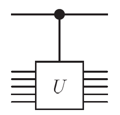
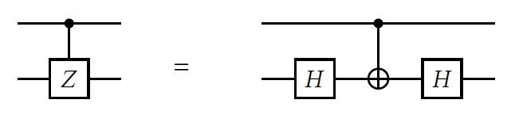

## Dirac notation and inner products
with each ket we can associate a bra that is its adjoint or conjugate transpose or Hermitian transpose.

$$
\begin{array}{cc}
    \langle 0 \lvert = \lvert 0 \rangle^{\dagger} = \bigg(
    \begin{array}{c}
    1 \\ 0
    \end{array}
    \bigg)^{\dagger}
    =
    \bigg(
    \begin{array}{c}
    1 & 0
    \end{array}
    \bigg)
    ,&
    \langle 0 \lvert = \lvert 0 \rangle^{\dagger} = \bigg(
    \begin{array}{c}
    0 \\ 1
    \end{array}
    \bigg)^{\dagger}
    =
    \bigg(
    \begin{array}{c}
    1 & 0
    \end{array}
    \bigg)
\end{array}
$$

and, in gernal,
$$
a\langle 0 \lvert + b\langle 1 \lvert = a\lvert 0 \rangle^{\dagger} + b\lvert 1 \rangle^{\dagger} = a \bigg(\begin{array}{c} 1 & 0 \end{array} \bigg) + b \bigg(\begin{array}{c} 0 & 1 \end{array} \bigg) = \bigg(\begin{array}{c} a & b \end{array} \bigg)
$$
More, we can also compute the following properties:

--inner product properties--

This proves that $\lvert 0 \rangle$ and $\lvert 1 \rangle$ are not just elements of any basis but of an **orthonormal** one, since $\lvert 0 \rangle$ and $\lvert 0 \rangle$ are orthogonal and of length 1. Thus we can calcualte the inner product of two states $\lvert \psi_{1} \rangle = a\lvert 0 \rangle + b\lvert 1 \rangle$ and $\lvert \psi_{2} \rangle = c\lvert 0 \rangle + d\lvert 1 \rangle$ as:

$$
\begin{array}{cll}
\langle \psi_{1}\lvert\psi_{2} \rangle^{\dagger} & = & (a^{*}\langle0\lvert+b^{*}\langle1\lvert)(c^{*}\lvert0\rangle+d^{*}\lvert1\rangle)\\
 & = & a^{*}c\langle0\lvert0\rangle+a^{*}d\langle0\lvert1\rangle+b^{*}c\langle1\lvert0\rangle+b^{*}d\langle1\lvert1\rangle\\
 & = & a^{*}b+c^{*}d
\end{array}
$$

where $a^{*}$ and $b^{*}$ are the complex cpmjugates of $a$ and $b$

## One-Qubit Quantum gates
### **The Schrodinger equation**
The time-dependent Schrödinger equation is given by:

$$
\hat{H} \lvert\psi(t)\rangle = i \hbar \frac{\partial \lvert\psi(t)\rangle}{\partial t}
$$

where:

1. $\hbar$ is the reduced Planck's constant,
2. $\lvert\psi(t)\rangle = \psi(x,t)$ is the wave function,
3. $\hat{H}$ is the Hamiltonian operator.

To program a quantum computer, you don’t need to know how to solve Schrödinger’s equation. In fact, the only thing that you need to know is that its solutions are always a special type of linear transformations. For the purposes of the quantum circuit model, since we are working in finite-dimensional spaces and we have fixed a basis, the operations can be described by matrices that are applied to the vectors that represent the states of the qubits.

## Two qubits and entanglement
### Two-qubit state

For a two-qubit state system, we have four possibilities form a basis(**computational basis**) of a 4-dimensional space,

$$
\begin{array}{cccc}
\lvert0\rangle \otimes \lvert0\rangle,& \lvert0\rangle \otimes \lvert1\rangle,& \lvert1\rangle \otimes \lvert0\rangle,& \lvert1\rangle \otimes \lvert1\rangle
\end{array}
$$
 
The symbol $\otimes$ is a [**tensor product**](../Math_Fundamentals/linear_algebr_tensor.md). The tensor product of two column vectors is defined by

### Tensor Product

The tensor product of two vectors is defined as:

$$
\begin{pmatrix}
a_1 \\
a_2 \\
\vdots \\
a_n
\end{pmatrix}
\otimes
\begin{pmatrix}
b_1 \\
b_2 \\
\vdots \\
b_m
\end{pmatrix}
=
\begin{pmatrix}
a_1
\begin{pmatrix}
b_1 \\
b_2 \\
\vdots \\
b_m
\end{pmatrix} \\
a_2
\begin{pmatrix}
b_1 \\
b_2 \\
\vdots \\
b_m
\end{pmatrix} \\
\vdots \\
a_n
\begin{pmatrix}
b_1 \\
b_2 \\
\vdots \\
b_m
\end{pmatrix}
\end{pmatrix}
=
\begin{pmatrix}
a_1 b_1 \\
a_1 b_2 \\
\vdots \\
a_1 b_m \\
a_2 b_1 \\
a_2 b_2 \\
\vdots \\
a_2 b_m \\
\vdots \\
a_n b_1 \\
a_n b_2 \\
\vdots \\
a_n b_m
\end{pmatrix}
$$

Therefore, we expand four states

$$
\begin{array}{cccc}
\lvert0\rangle \otimes \lvert0\rangle = \begin{pmatrix} 1 \\ 0 \\ 0 \\ 0 \end{pmatrix}, & 
\lvert0\rangle \otimes \lvert1\rangle = \begin{pmatrix} 0 \\ 1 \\ 0 \\ 0 \end{pmatrix}, & 
\lvert1\rangle \otimes \lvert0\rangle = \begin{pmatrix} 0 \\ 0 \\ 1 \\ 0 \end{pmatrix}, & 
\lvert1\rangle \otimes \lvert1\rangle = \begin{pmatrix} 0 \\ 0 \\ 0 \\ 1 \end{pmatrix} 
\end{array}
$$

We usually omit the $\otimes$ and just write,

$$
\begin{array}{cccc}
\lvert00\rangle, &
\lvert01\rangle, &
\lvert10\rangle, &
\lvert11\rangle &
\end{array}
$$

The general expression for the state of such system is 

$$
\lvert\psi\rangle = a_{00}\lvert00\rangle+a_{01}\lvert01\rangle+a_{10}\lvert10\rangle+a_{11}\lvert11\rangle
$$

where $a_{00}, a_{01}, a_{10}, a_{11}$ are complex numbers or amplitudes such that $\sum_{x, y=0}^{1}|a_{xy}|^{2} = 1$. If we measure in the computational basis both qubits at this generic state that we are considering, we will obtain $\gamma$ with probability $|a_{\gamma}|^{2}$ where $\gamma \in [00, 01, 10, 11]$.

### What if we only measure one computational basis 0? 

The result will show that the system is not collapse completely, but it will remain in the state

$$
\frac{a_{00}\lvert00\rangle+a_{01}\lvert01\rangle}{\sqrt{|a_{00}|^{2} + |a_{01}|^{2}}}
$$

Also, recall the inner product of the one qubit case, we can apply inner product to 

$$
(\langle\psi_{2}\lvert\otimes\langle\psi_{2}\lvert)(\lvert\phi_{1}\rangle\otimes\lvert\phi_{2}\rangle) = \langle\phi_{1}\lvert\phi_{1}\rangle\langle\phi_{2}\lvert\phi_{2}\rangle
$$

### Two-qubit gate: tensor products

The tensor product of two matrices is defined as:

$$
\begin{pmatrix}
a_{11} & a_{12} \\
a_{21} & a_{22}
\end{pmatrix}
\otimes
\begin{pmatrix}
b_{11} & b_{12} \\
b_{21} & b_{22}
\end{pmatrix}
=
\begin{pmatrix}
a_{11}
\begin{pmatrix}
b_{11} & b_{12} \\
b_{21} & b_{22}
\end{pmatrix} &
a_{12}
\begin{pmatrix}
b_{11} & b_{12} \\
b_{21} & b_{22}
\end{pmatrix} \\
a_{21}
\begin{pmatrix}
b_{11} & b_{12} \\
b_{21} & b_{22}
\end{pmatrix} &
a_{22}
\begin{pmatrix}
b_{11} & b_{12} \\
b_{21} & b_{22}
\end{pmatrix}
\end{pmatrix}
$$

$$
=
\begin{pmatrix}
a_{11} b_{11} & a_{11} b_{12} & a_{12} b_{11} & a_{12} b_{12} \\
a_{11} b_{21} & a_{11} b_{22} & a_{12} b_{21} & a_{12} b_{22} \\
a_{21} b_{11} & a_{21} b_{12} & a_{22} b_{11} & a_{22} b_{12} \\
a_{21} b_{21} & a_{21} b_{22} & a_{22} b_{21} & a_{22} b_{22}
\end{pmatrix}.
$$

### CNOT Gate

CNOT gate: The value of the second qubit is flipped if and only if the value of the first qubit is 1. The application of a NOT gate on the second qubit (that we call the **target**) is **controlled** by the first qubit.


Notice that the control qubit is indicated by a solid black circle and the target qubit is indicated by the $\oplus$ symbol (the symbol for an $X$ gate can also be used instead of $\oplus$).

$$
\text{CNOT} =
\begin{pmatrix}
1 & 0 & 0 & 0 \\
0 & 1 & 0 & 0 \\
0 & 0 & 0 & 1 \\
0 & 0 & 1 & 0
\end{pmatrix}.
$$

And, if we apply `CNOT` gate on the element of the two-qubit computational basis, we can get,

$$
\begin{array}{cccc}
\text{CNOT}\lvert00\rangle = \lvert00\rangle,& 
\text{CNOT}\lvert01\rangle = \lvert01\rangle,& 
\text{CNOT}\lvert10\rangle = \lvert11\rangle,& 
\text{CNOT}\lvert11\rangle = \lvert10\rangle
\end{array}
$$

### Swap 


In any case, the most prominent use of the CNOT gate is, without a doubt, the ability to create **entanglement**.

### Entanglement

```
Entanglement, without doubt, is one of the most powerful resources available in quantum computing!
```

We say the a state $\lvert\psi\rangle$ is a **product state** if it can be written as the tensor product of two other states $\lvert\psi_{1}\rangle$ and $\lvert\psi_{2}\rangle$, each of at least one qubit, as in

$$
\lvert\psi\rangle = \lvert\psi_{1}\rangle \otimes \lvert\psi_{2}\rangle
$$

If $\lvert\psi_{1}\rangle$ is not a product, we say that it is **entangled**. For instance, we said that $\lvert00\rangle$ is a product state, since we can write it as $\lvert\psi_{0}\rangle\otimes \lvert\psi_{0}\rangle$. In the same fashion, we can also write $\frac{1}{\sqrt{2}}(\lvert00\rangle+\lvert10\rangle)$ in a product state as:

$$
\frac{1}{\sqrt{2}}(\lvert00\rangle+\lvert10\rangle) = \frac{1}{\sqrt{2}}\bigg(\lvert0\rangle+\lvert1\rangle\bigg)\lvert0\rangle
$$

However, state $\frac{1}{\sqrt{2}}(\lvert00\rangle+\lvert11\rangle)$ is an **entangled** state since no matter how hard you try you cannot factor it into a product state. here, we can try to proof this by:

$$
\begin{array}{lll}
\frac{1}{\sqrt{2}}(\lvert00\rangle+\lvert11\rangle) & = & (a\lvert0\rangle+b\lvert1\rangle)(c\lvert0\rangle+d\lvert1\rangle)\\
 & = & ac\lvert00\rangle + ad\lvert01\rangle + bc\lvert10\rangle + bd\lvert11\rangle
\end{array}
$$

we need $ad$ and $bc$ to be $0$, because we don't have $\lvert01\rangle$ element in $\frac{1}{\sqrt{2}}(\lvert00\rangle+\lvert11\rangle)$. Then, either $a = 0$, inwhice case $ac = 0$ or $d=0$ from which $bd=0$ follows. These two cases cannot reach the equality that we needed. Thus, we can say that this state is {==**entangled**==}.

When we measure an entangled state, let's say, state $\frac{1}{\sqrt{2}}(\lvert00\rangle+\lvert11\rangle)$, we measure the firt qubit, we can obtain $0$ or $1$, with each probability of $50\%$. In this case, the state of the second qubit is detemined when we measure the first qubit, which will be the same as the first qubit. And so does the probability of the first qubit if we measure the second qubit first in our case.

### The no-cloning therom
Another interesring property of quantum systems is the no-cloning theorm. Check [No-cloning](../quantum_mechanics/No-cloing.md) for proof. In short, for an example, if we would like to have a {==two-qubit quantum gate $U$ that will be able to copy the first qubit into the second==}. we would need,

$$
U(\lvert\psi\rangle \otimes \lvert0\rangle) = \lvert\psi\rangle \otimes \lvert\psi\rangle
$$

from above, we know that $U\lvert00\rangle = \lvert00\rangle$ and $U\lvert10\rangle = \lvert11\rangle$. Therefore,

$$
U\bigg(\frac{1}{\sqrt{2}}(\lvert00\rangle + \lvert10\rangle)\bigg) = \frac{1}{\sqrt{2}}(U\lvert00\rangle + U\lvert10\rangle) = \frac{1}{\sqrt{2}}(\lvert00\rangle + \lvert11\rangle).
$$

Then, from previous example, we also know that $\frac{1}{\sqrt{2}}(\lvert00\rangle + \lvert10\rangle$ can be written in a product form,

$$
\frac{1}{\sqrt{2}}(\lvert00\rangle + \lvert10\rangle = \frac{1}{\sqrt{2}}\bigg(\lvert0\rangle + \lvert1\rangle\bigg)\lvert0\rangle 
$$

Now, let's apply gate $U$, we should have,

$$
U\frac{1}{\sqrt{2}}(\lvert00\rangle + \lvert10\rangle = U\bigg(\frac{1}{\sqrt{2}}\bigg(\lvert0\rangle + \lvert1\rangle\bigg)\lvert0\rangle\bigg) =  \frac{\lvert0\rangle + \lvert1\rangle}{\sqrt{2}}\frac{\lvert0\rangle + \lvert1\rangle}{\sqrt{2}}
$$

which is a product state, and we also know have $U\bigg(\frac{1}{\sqrt{2}}(\lvert00\rangle + \lvert10\rangle)\bigg) = \frac{1}{\sqrt{2}}(\lvert00\rangle + \lvert11\rangle)$,

$$
\frac{\lvert0\rangle + \lvert1\rangle}{\sqrt{2}}\frac{\lvert0\rangle + \lvert1\rangle}{\sqrt{2}}\neq \frac{1}{\sqrt{2}}(\lvert00\rangle + \lvert11\rangle)
$$

therefore, no such gate $U$ exist.

### Controlled gates.
For any quantum gate $U$, it is possible to define a **controlled-U** (or **CU**) gate whose action on the computational basis is,

$$
\begin{array}{cccc}
CU\lvert00\rangle = \lvert00\rangle,& 
CU\lvert01\rangle = \lvert01\rangle,& 
CU\lvert10\rangle = \lvert1U0\rangle,& 
CU\lvert11\rangle = \lvert1U1\rangle,& 
\end{array}
$$

The matrix representing the controlled U is,

$$
\begin{bmatrix}
1 & 0 & 0 & 0\\
0 & 1 & 0 & 0\\
0 & 0 & u_{00} & u_{01}\\
0 & 0 & u_{10} & u_{11}\\
\end{bmatrix}
$$

The circuit representation of a $CU$ gate is,



where the solid black circle indicates the control and the box with $U$ inside indicates the target. For any one-qubit quantum gate $U$ can be written in the form,

$$
U = e^{i\theta} AXBXC
$$

for some angle $\theta$ and gates $A$, $B$, $C$ such that $ABC = I$. Sometimes,, its easy to construct a contrelled gate. For instance, two $H$-gates with one $$-gate can make one controlled $Z$-gate.



Sometimes, constructing a controlled gate is mush easier. it can be shown that a controlled-Z gate.

### Entangled circuit

Let's consider the bell state. First we consider the computational basis $\lvert00\rangle$ and apply and $H$-gate. Then we apply a CNOT gate. The state change from $\frac{\lvert00\rangle+\lvert10\rangle}{\sqrt{2}}$ to $\frac{\lvert00\rangle+\lvert11\rangle}{\sqrt{2}}$, which we have already proved that is indeed an entangled state.


Below are the four possible Bell states:

$$
\begin{aligned}
\lvert\beta_{00}\rangle = \lvert\Phi^+\rangle & = \frac{\lvert00\rangle + \lvert11\rangle}{\sqrt{2}} \\
\lvert\beta_{01}\rangle = \lvert\Psi^+\rangle & = \frac{\lvert01\rangle + \lvert10\rangle}{\sqrt{2}} \\
\lvert\beta_{10}\rangle = \lvert\Phi^-\rangle & = \frac{\lvert00\rangle - \lvert11\rangle}{\sqrt{2}} \\
\lvert\beta_{11}\rangle = \lvert\Psi^-\rangle & = \frac{\lvert01\rangle - \lvert10\rangle}{\sqrt{2}}
\end{aligned}
$$

All of these four states are {==**entangled**==}.

## Multiple qubits and universality

### Multi-qubit systems
If we ahve $n$ qubits, the states that constitute the computational basis are,

$$
\begin{array}{c}
\lvert0\rangle \otimes \lvert0\rangle \otimes \cdots \otimes \lvert0\rangle,\\
\lvert0\rangle \otimes \lvert0\rangle \otimes \cdots \otimes \lvert1\rangle,\\
\vdots\\
\lvert1\rangle \otimes \lvert1\rangle \otimes \cdots \otimes \lvert1\rangle\\
\end{array}
$$

Omit the tensor symbol $\otimes$,

$$
\begin{array}{c}
\lvert0\rangle \lvert0\rangle \cdots \lvert0\rangle,\\
\lvert0\rangle \lvert0\rangle \cdots \lvert1\rangle,\\
\vdots\\
\lvert1\rangle \lvert1\rangle \cdots \lvert1\rangle\\
\end{array}
$$

or 

$$
\lvert00\cdots 0\rangle, \lvert00\cdots 1\rangle, \lvert11\cdots 1\rangle, 
$$

or simply

$$
\lvert0\rangle, \lvert1\rangle, \cdots, \lvert2^{n}-1\rangle
$$

when we use the notation $\lvert0\rangle, \lvert1\rangle, \cdots, \lvert2^{n}-1\rangle$ for the basis states, the total number of qubits must be clear from context. Otherwise, for example $\lvert2\rangle$ might mean either $\lvert10\rangle$, $\lvert010\rangle$, or $\lvert0010\rangle$ or any string with leading zeros and ending in 10.

The Generic state of the system will then be if the form

$$
\lvert\psi\rangle = a_{0}\lvert0\rangle + a_{1}\lvert1\rangle + \cdots + a_{2^{n-1}}\lvert2^{n}-1\rangle 
$$

Same, the only condition that the amplitudes $a_i$ should be complex numbers such that $\sum_{l=0}^{2^{n}-1}|a_l|^{2} = 1$, that is, the sum of the coefficient square shoud be 1 (normalization condition). 

!!! tip "Power of the quantum computing!"
    Part of the power of quantum computing comes from this possibility of implicitly working with $2^{n}$ complex numbers by manipulating just $n$ qubits.

If we decide to measure all the qubits of the system in the computational basis, we will obtain $m$ with probability $|a_m|^{2}$. If that's the case, then the state will collapse to $\lvert m\rangle$. But if we only measure one of the qubits. says the $j$-th one, then we will obtain 0 with probability 

$$
\sum_{l\in J_{0}}|a_{l}|^{2}
$$

where $J_{0}$ is the set of numbers whose $j$-th bit is 0. In this scenario, the state of the system after measuring 0 would be 

$$
\lvert\psi_{0}\rangle = \frac{\sum_{l\in J_{0}}a_{l}\lvert l\rangle}{\sqrt{\sum_{l\in J_{0}}\lvert a_{l}\lvert^{2}}}
$$

if we measure 1 as same as the case above, we will obtain the probability 

$$
P(1) = \sum_{l\in J_{1}}|a_{l}|^{2}
$$

and the system state of

$$
\lvert\psi_{1}\rangle = \frac{\sum_{l\in J_{1}}a_{l}\lvert l\rangle}{\sqrt{\sum_{l\in J_{1}}\lvert a_{l}\lvert^{2}}}
$$

As for the product operation, $n$-qubit systems act similarly with the two-qubit system

$$
(\langle\psi_{1}\lvert\otimes\cdots\otimes\langle\psi_{n}\lvert)(\langle\phi_{1}\lvert\otimes\cdots\otimes\langle\phi_{n}\lvert) = \langle\psi_{1}\lvert\phi_{1}\rangle \cdots \langle\psi_{n}\lvert\phi_{n}\rangle.
$$

### Example n = 3 qubits
Let's consider an example for $n = 3$ qubits. The state of the system is given as:

$$
\lvert\psi\rangle = a_0 \lvert000\rangle + a_1 \lvert001\rangle + a_2 \lvert010\rangle + a_3 \lvert011\rangle + a_4 \lvert100\rangle + a_5 \lvert101\rangle + a_6 \lvert110\rangle + a_7 \lvert111\rangle,
$$

where $a_0, a_1, \ldots, a_7$ are the complex amplitudes.

Measurement on the 2nd Qubit ($j = 2$)
Here, the 2nd qubit corresponds to the **middle bit** in each computational basis state. Let's compute the probabilities and post-measurement states for the result being $0$ or $1$.

Case 1: Measuring the 2nd Qubit as $1$
- $J_1$ is the set of all indices where the 2nd bit is $1$. These are $J_1 = \{2, 3, 6, 7\}$, corresponding to the states:
$$
\{\lvert010\rangle, \lvert011\rangle, \lvert110\rangle, \lvert111\rangle\}.
$$

- **Probability of measuring 1:**
The probability of obtaining $1$ is:
$$
P(1) = \sum_{l \in J_1} |a_l|^2 = |a_2|^2 + |a_3|^2 + |a_6|^2 + |a_7|^2.
$$

- **Post-measurement state:**
After measuring $1$, the system collapses to:
$$
\lvert\psi_{1}\rangle = \frac{a_2 \lvert010\rangle + a_3 \lvert011\rangle + a_6 \lvert110\rangle + a_7 \lvert111\rangle}{\sqrt{|a_2|^2 + |a_3|^2 + |a_6|^2 + |a_7|^2}}.
$$

Case 2: Measuring the 2nd Qubit as $0$
- $J_0 $ is the set of all indices where the 2nd bit is $0$. These are $J_0 = \{0, 1, 4, 5\}$, corresponding to the states:
$$
\{\lvert000\rangle, \lvert001\rangle, \lvert100\rangle, \lvert101\rangle\}.
$$

- **Probability of measuring 0:**
The probability of obtaining $0$ is:
$$
P(0) = \sum_{l \in J_0} |a_l|^2 = |a_0|^2 + |a_1|^2 + |a_4|^2 + |a_5|^2.
$$

- **Post-measurement state:**
After measuring $0$, the system collapses to:
$$
\lvert\psi_{0}\rangle = \frac{a_0 \lvert000\rangle + a_1 \lvert001\rangle + a_4 \lvert100\rangle + a_5 \lvert101\rangle}{\sqrt{|a_0|^2 + |a_1|^2 + |a_4|^2 + |a_5|^2}}.
$$

---

Example with Numbers
Let’s assign specific values to the amplitudes $a_0, a_1, \ldots, a_7$. Suppose:
$$
a_0 = \frac{1}{\sqrt{8}}, \; a_1 = \frac{1}{\sqrt{8}}, \; a_2 = \frac{1}{\sqrt{8}}, \; a_3 = \frac{1}{\sqrt{8}}, \; a_4 = \frac{1}{\sqrt{8}}, \; a_5 = \frac{1}{\sqrt{8}}, \; a_6 = \frac{1}{\sqrt{8}}, \; a_7 = \frac{1}{\sqrt{8}}.
$$

Probability of measuring $1$ in the 2nd qubit:
$$
P(1) = |a_2|^2 + |a_3|^2 + |a_6|^2 + |a_7|^2 = 4 \cdot \left(\frac{1}{\sqrt{8}}\right)^2 = \frac{4}{8} = 0.5.
$$

Post-measurement state when $1$ is measured:
The new state is:

$$
\begin{array}{lll}
\lvert\psi_{1}\rangle & = & \frac{\frac{1}{\sqrt{8}} \lvert010\rangle + \frac{1}{\sqrt{8}} \lvert011\rangle + \frac{1}{\sqrt{8}} \lvert110\rangle + \frac{1}{\sqrt{8}} \lvert111\rangle}{\sqrt{0.5}} \\
 & = & \frac{1}{2} (\lvert010\rangle + \lvert011\rangle + \lvert 110\rangle + \lvert 111\rangle).
\end{array}
$$


## Multi-qubit gates


## Universal gates in quantum computing

---
Ref: A Practical Guide to Quantum Machine Learning and Quantum Optimization_ Hands-on Approach to Modern Quantum Algorithms